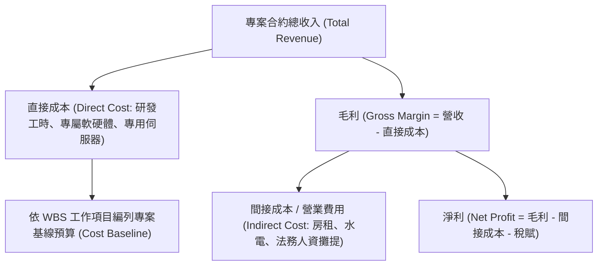

# 🛡️ PM-01-COST-BUDGETING 專案管理實務 Lesson 01：專案成本管理、直接成本 vs. 間接成本與預算編列技術

> **課程主題**：專案成本管理（Cost Management）、直接成本／間接成本拆解、毛利率計算與預算編列  
> **授課教授**：授課講師（專案管理授課教授）  
> **核心模組**：Project Cost Estimation, Direct & Indirect Costs, Gross Margin, WBS Costing  
> **學習目標**：理解專案損益結構、精準拆解執行團隊直接成本與企業營運管銷費用  
> **關聯文件**：[📄 完整原話逐字稿 (2024-10-15-01-直接成本與預算編列-proofread.md)](./2024-10-15-01-直接成本與預算編列-proofread.md)

---

## 🏛️ 核心架構與概念流轉圖

---

## 🔑 重點提要 (Key Takeaways)

1. **直接成本 vs. 間接成本**：直接成本是專案不接就不會發生的成本（如專案外包費、專案成員工時）；間接成本是公司日常維持必須分攤的管銷費用。
2. **毛利是專案存亡關鍵**：報價時若只估算直接成本而忽略間接成本分攤與風險準備金，接案愈多虧損愈大。
