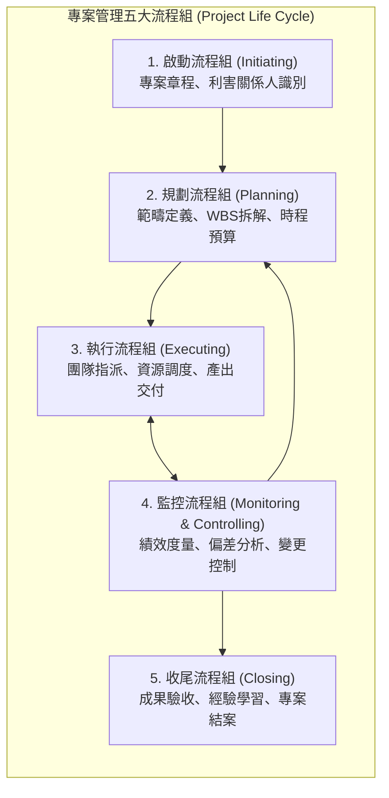
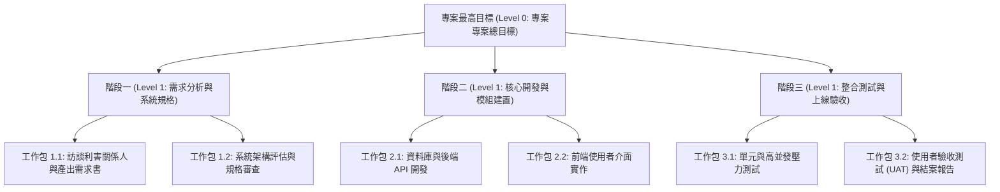

# 🛡️ PM-02-LIFECYCLE-WBS 專案管理實務 Lesson 02：專案生命週期五大流程組、十大知識體系與工作分解結構 WBS

> **課程主題**：專案生命週期五大流程組、十大知識領域、工作分解結構（WBS）拆解原則與產出物驗收  
> **授課教授**：授課講師（專案管理授課教授）  
> **核心模組**：Project Life Cycle, WBS Work Breakdown, 100% Rule, Scope Management, Milestone Review  
> **學習目標**：掌握專案五大流程組與工作分解結構（WBS）之 100% 拆解原則，有效預防範疇蔓延與收尾驗收爭議  
> **關聯文件**：[📄 完整原話逐字稿 (2024-10-21-02-生命週期與WBS工作分解-proofread.md)](./2024-10-21-02-生命週期與WBS工作分解-proofread.md)

---

## 🏛️ 專案生命週期與五大流程組循環

---

## 📊 工作分解結構 (WBS) 階層展開

---

## 🎯 核心重點整理 (Key Takeaways)

### 1. 專案的本質與組織變革
- **專案 vs. 常態營運**：專案具備「獨特性（Uniqueness）」與「暫時性（Temporary）」，目標達成後即解散交付；常態營運則具備重複性與持續性。
- **組織扁平化與知識爆炸**：現代企業因應快速變革，傳統科層式管理弱化，各項任務轉化為專案導向運作，仰賴專案經理統籌跨部門資源。

### 2. 工作分解結構 (WBS) 之 100% 原則
- **100% 原則 (100% Rule)**：WBS 樹狀圖所涵蓋的子工作包總和，必須 100% 等於母項任務的範疇，既無遺漏（Omission），亦不可衍生範疇蔓延（Scope Creep）。
- **工作包 (Work Package) 定義準則**：
  - 獨立性高、界面清晰。
  - 工時可精確預估（通常介於 8 到 80 小時之間）。
  - 單一負責人（Single Point of Contact, SPOC）。

### 3. 利害關係人溝通與收尾驗收防禦
- **專案收尾的非典型困難**：軟體專案常因前期未確立清晰「驗收標準（Acceptance Criteria）」，導致客戶在收尾階段提出大幅度介面或功能變更要求。
- **漸進明細（Progressive Elaboration）與期中審查**：在各個關鍵里程碑邀請客戶實機驗收（Milestone Review），提早暴露出落差，避免最終驗收時推倒重來。
