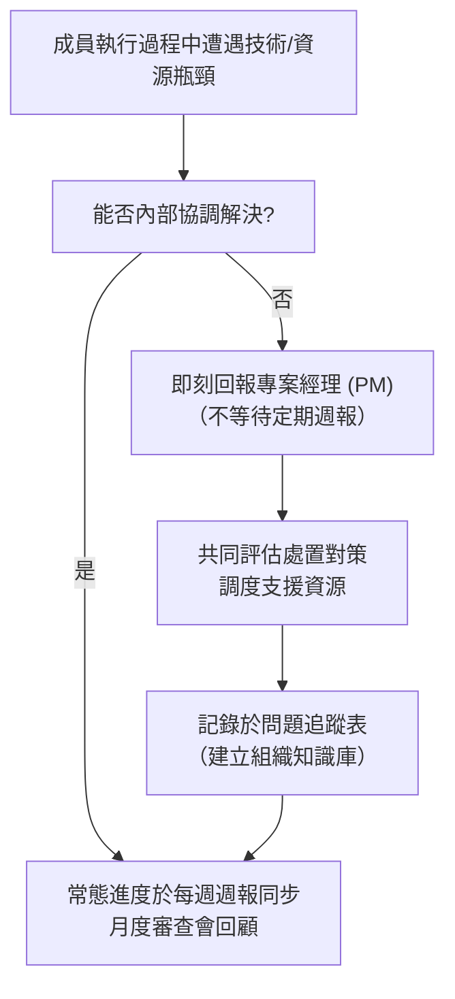
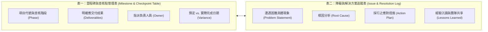

# 🛡️ PM-03-CHECKPOINTS-COMMUNICATION 專案管理實務 Lesson 03：專案進度查核點設計、團隊溝通管理計畫與雙表追蹤機制

> **課程主題**：專案溝通管理計畫（Communication Plan）、查核點（Checkpoints）雙表追蹤與團隊同理激勵  
> **授課教授**：授課講師（專案管理授課教授）  
> **核心模組**：Communication Management, Checkpoint Design, Issue Tracking, Active Listening  
> **學習目標**：建立專案透明升級管道與節奏化會議制度，運用進度與障礙雙表確保專案交付無死角  
> **關聯文件**：[📄 完整原話逐字稿 (2024-10-23-03-進度查核點與團隊溝通-proofread.md)](./2024-10-23-03-進度查核點與團隊溝通-proofread.md)

---

## 🏛️ 專案溝通與問題升級機制 (Escalation Path)

---

## 📋 專案進度與問題查核雙表運作模型

---

## 🎯 核心重點整理 (Key Takeaways)

### 1. 溝通管理計畫的遊戲規則制定
- **即時回報原則**：專案遭遇卡點時，應主動向 PM 尋求協調，嚴禁將問題壓箱至例行會議才揭露，避免損失黃金應對時效。
- **節奏化會議**：
  - **每週週報**：回顧上週完成事項、本週規劃、現存阻礙。
  - **月度審查會議**：針對關鍵里程碑進行整體預算、進度與範疇對齊。

### 2. 查核點 (Checkpoint) 的設計哲學
- **明確產出物判定**：查核點不可流於抽象趴數（如「完成 80%」），必須有清晰的交付物判定依據（如「規格書簽署完成」、「第一版 API 測試通過」）。
- **知識資產沉澱**：記錄成員解決問題之歷程，供團隊其他專案或後續人員借鑑，降低重複試錯成本。

### 3. 軟性管理：傾聽與全員參與感
- **同理心傾聽**：專案經理若一味強推決策，易導致沉默或消極抗拒；多方傾聽沉默成員的想法，能提高團隊向心力與認同感。
- **激勵團隊自驅力**：當團隊成員提出的回饋在專案中被具體採納時，能極大化其成就感與責任擔當。
