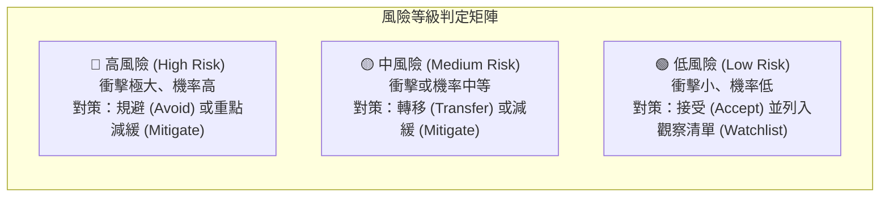
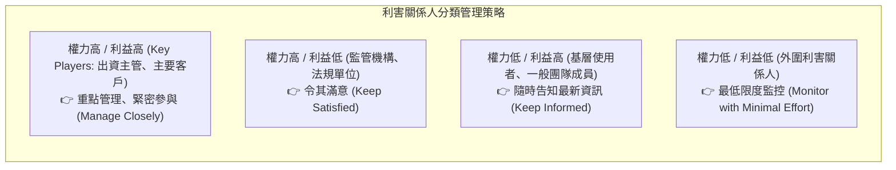

# 🛡️ PM-06-SIMULATION-RISK-STAKEHOLDERS 專案管理實務 Lesson 06：極限專案成本模擬、風險矩陣與利害關係人管理

> **課程主題**：極限專案成本架構、高擬真模擬機事前驗證、風險評估矩陣（Risk Matrix）與利害關係人參與管理  
> **授課教授**：授課講師（專案管理授課教授）  
> **核心模組**：Extreme Project Management, Simulation Costs, Risk Matrix, Stakeholder Analysis, Resistance Handling  
> **學習目標**：理解極限專案中高昂驗證模擬的必要性，掌握風險發生機率與衝擊矩陣，並建立利害關係人抗拒之轉化機制  
> **關聯文件**：[📄 完整原話逐字稿 (2024-11-19-06-成本風險矩陣與利害關係人-proofread.md)](./2024-11-19-06-成本風險矩陣與利害關係人-proofread.md)

---

## 🏛️ 風險機率與衝擊量化矩陣 (Probability-Impact Matrix)

---

## 👥 利害關係人權力與利益矩陣 (Power-Interest Grid)

---

## 🎯 核心重點整理 (Key Takeaways)

### 1. 極限專案與高擬真模擬成本哲學
- **事前驗證的高昂代價**：以載人太空船專案為例，太空人訓練與極端情境模擬器的造價往往逼近甚至超越專案實體本體。然而相較於飛行發射失敗的全盤毀滅，事前的高額模擬投入是絕對必要且最合算的風險控制手段。
- **軟體專案借鏡**：在金融交易或核心伺服器專案中，打造高並發壓力測試環境與預發行環境（Staging Environment）即等同於「模擬機」，能防範災難性生產事故。

### 2. 風險管理遊戲規則先行
- **明確風險級別準則**：在團隊展開 WBS 與風險評估前，PM 必須預先定義何謂「高、中、低風險」（例如：延誤 1 週 vs. 1 個月；損失 10 萬 vs. 100 萬），避免團隊成員因個人主觀偏差而低估系統性風險。

### 3. 利害關係人抗拒應對之道
- **識別關鍵利害關係人**：分清「出資者（Sponsor）」、「核心團隊」、「審查主管」與「終端用戶」。
- **化解抗拒策略**：抗拒者通常源於對專案帶來改變的不安全感或利益受損。PM 應提早與抗拒者一對一溝通，探尋其根本顧慮，並在專案目標中融入對其有利的配套措施，將阻力化為助力。
