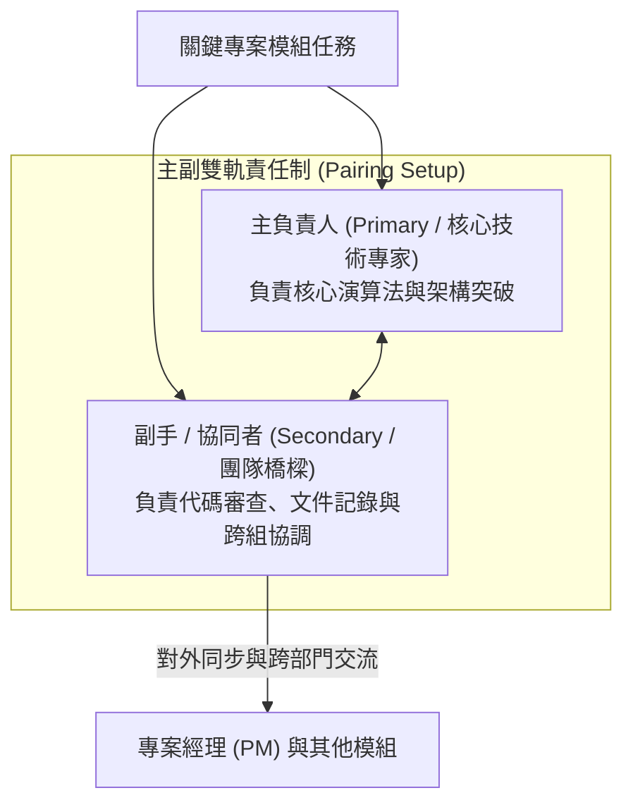
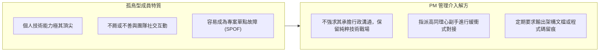

# 🛡️ PM-07-CROSS-GEN-COLLABORATION 專案管理實務 Lesson 07：跨世代研發團隊協作、專家整合與溝通領導實務

> **課程主題**：專案團隊建立（Team Building）、跨世代協作、孤鳥型技術專家管理與雙軌主副責任制  
> **授課教授**：授課講師（專案管理授課教授）  
> **核心模組**：Team Dynamics, Cross-Generation Collaboration, Technical Lone Wolves, Pairing System  
> **學習目標**：掌握多樣化團隊動態管理心法，妥善調處技術天才與團隊溝通落差，並建立主副雙軌備援制確保專案永續交付  
> **關聯文件**：[📄 完整原話逐字稿 (2024-11-19-07-跨世代研發團隊協作-proofread.md)](./2024-11-19-07-跨世代研發團隊協作-proofread.md)

---

## 🏛️ 專案團隊協作雙軌制 (Primary-Secondary Pairing Model)

---

## ⚡ 「孤鳥型」技術天才之整合策略

---

## 🎯 核心重點整理 (Key Takeaways)

### 1. 團隊協作重於個人英雄主義
- **孤鳥成員的專案風險**：部分技術能力頂尖的工程師習慣單打獨鬥、拒絕溝通，在專案管理中這類「孤鳥」若無良好機制包裝，將導致模組黑盒子化，一旦其離職或生病，整個專案將陷入停擺。
- **主副責任制（Primary-Secondary Setup）**：重要工作包指派一名主負責人與一名副手。主負責人主攻技術攻堅，副手協助溝通協調與知識備份，兼顧效率與專案風險分散。

### 2. 跨世代團隊的領導新思維
- **手遊與新創團隊生態**：以 30 歲以下年輕工程師為主體的研發團隊，思維跳躍、追求酷炫與自主性。傳統威權由上而下的命令式管理不再奏效，專案領導者需轉型為「教練與僕人式領導（Servant Leadership）」，營造彈性自主的氛圍以激發其創造力。
