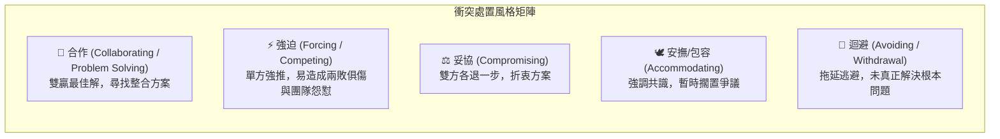

# 🛡️ PM-10-CONFLICT-RESOLUTION-EVM 專案管理實務 Lesson 10：專案衝突解決矩陣、強勢成員處置與實獲值 EVM 控制

> **課程主題**：專案溝通衝突解決模式（Thomas-Kilmann 模型）、破壞性強勢成員處置、事實證據導向與實獲值管理（EVM）動態策略校準  
> **授課教授**：授課講師（專案管理授課教授）  
> **核心模組**：Conflict Resolution, Toxic Experts Handling, Fact-Based Communication, EVM Dynamic Control  
> **學習目標**：精熟專案衝突之五種應對手法，掌握強勢破壞型技術專家之風險隔離備援方案，並透過 EVM 動態調整時程與預算  
> **關聯文件**：[📄 完整原話逐字稿 (2024-11-27-10-衝突解決矩陣與EVM動態控制-proofread.md)](./2024-11-27-10-衝突解決矩陣與EVM動態控制-proofread.md)

---

## 🏛️ 專案衝突解決五大模式 (Thomas-Kilmann Conflict Mode)

---

## 🎯 核心重點整理 (Key Takeaways)

### 1. 事實與證據導向溝通（Fact-Based）
- **避免情緒化爭執**：專案出現爭議時，PM 應要求雙方拿出客觀數據、測試報告與系統 Log 說話，以事實證據（Evidence）為決策基準，杜絕主觀臆測。

### 2. 強勢破壞型專家的風險處置
- **兩敗俱傷的強迫風格**：部分核心成員雖具技術能力，但處處強推己見、霸凌隊友。
- **風險防禦對策**：PM 必須在不激化衝突的前提下，私下培訓備援人選（Shadowing / Backup），逐步降低專案對單一破壞型人員的依賴，最終在適當時機將其移出團隊。

### 3. EVM 動態調整循環
- **持續修正策略**：若專案呈現「時程超前但成本超支」，應評估是否投入過多加班費用；若「成本節省但進度落後」，需評估是否需適度增補外包資源以追回進度。
