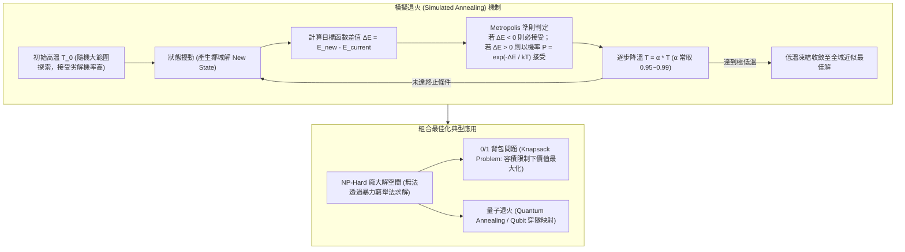

# ⚙️ PM-07-SIMULATED-ANNEALING-OPTIMIZATION 專案管理與工程實作：模擬退火演算法、組合最佳化與背包問題求解

> **研討主題**：專案管理工程實作、模擬退火演算法（Simulated Annealing）、Metropolis 準則與 0/1 背包問題最佳化求解  
> **專案人員**：專案主講人、專案開發組員  
> **核心模組**：Simulated Annealing, Combinatorial Optimization, Metropolis Criterion, Knapsack Problem, Local vs Global Optimum  
> **學習目標**：精熟模擬退火降溫曲線與機率接受機制、理解組合最佳化問題建模與啟發式演算法工程落地  
> **關聯文件**：[📄 完整原話逐字稿 (20241209-模擬退火最佳化與背包問題演算法研討.full.md)](./20241209-模擬退火最佳化與背包問題演算法研討.full.md)

---

## 🏛️ 模擬退火演算法流程與組合最佳化求解架構

---

## 🎯 核心重點整理 (Key Takeaways)

### 1. 模擬退火（Simulated Annealing）底層物理思維
- **金屬退火之工程借喻**：將固體加熱至高溫使內部原子具備高動能劇烈跳動，隨後緩慢冷卻，使原子逐步排列至能量最低之穩定晶格結構。
- **跳脫局部最佳解（Local Optimum）**：傳統貪婪爬山法極易受困於局部山峰；模擬退火引入 **Metropolis 接受準則**，在高溫時期以一定機率接受劣解（朝較差方向移動），賦予演算法跳出局部陷阱並探索全域最佳解（Global Optimum）之能力。

### 2. 組合最佳化與背包問題求解
- **龐大解空間的啟發式求解**：面對無法用暴力窮舉（Exhaustive Search）之巨大組合空間，模擬退火能以多項式時間收斂出高品質近似最佳解。
- **0/1 背包問題限制式**：在背包總承載重量限制下，決定各物品選取二元變數 $x_i \in \{0, 1\}$，使總利益最大化。

### 3. 量子退火與企業研發合作延伸
- **量子穿隧效應（Quantum Tunneling）**：有別於古典熱擾動越過能量屏障，量子退火透過穿隧效應直接貫穿細長勢壘，在處理超高維稀疏離散問題上具備理論加速潛力。
