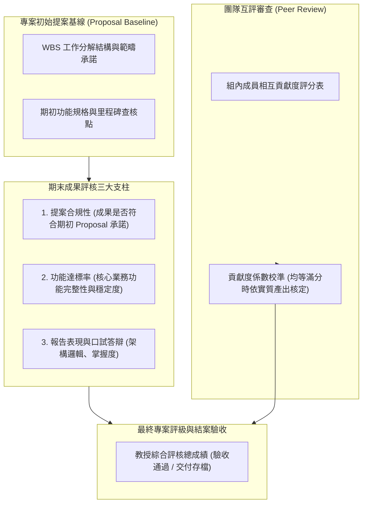

# 📋 PM-08-FINAL-PROJECT-EVALUATION 專案管理期末成果驗收：團隊互評機制與提案合規性評分標準

> **課程主題**：專案管理期末專案結案評審、提案合規性檢驗、功能達標率審核與組內互評權重機制  
> **授課教授**：授課指導教授（資管系專案管理教授）  
> **核心模組**：Project Acceptance, Proposal Baseline Verification, Functional Completeness, Peer Review  
> **學習目標**：深刻理解專案結案驗收標準、基線變更控制重要性與團隊成員貢獻度公平衡量機制  
> **關聯文件**：[📄 完整原話逐字稿 (20241224-期末專案互評與成果驗收準則.full.md)](./20241224-期末專案互評與成果驗收準則.full.md)

---

## 🏛️ 專案期末驗收與綜合評估流程圖

---

## 🎯 核心重點整理 (Key Takeaways)

### 1. 期末成果驗收之「基線對比」原則
- **Proposal 合規性檢視**：評分最核心的基線在於專案最終產出是否與學期初所提交之專案企劃書（Proposal）與規格承諾相互吻合，杜絕「做A報B」之範疇蔓延或擅自縮水現象。
- **功能達標率考核**：逐一檢核當初承諾之核心功能模組是否確實開發完成並能進行動態穩定展示。

### 2. 同儕互評表（Peer Review）機制
- **滿分防弊與校準**：當組員間相互給予滿分時，互評表對總成績之鑑別度相對中立；指導教授會直接根據每位組員在現場報告所負責之章節、程式碼實際提交紀錄與提問答辯掌握深度進行實質加權評分。
- **個別貢獻度鑑別**：確保每位組員之成績真實反映個人在團隊中的專案任務承擔與技術交付價值。
