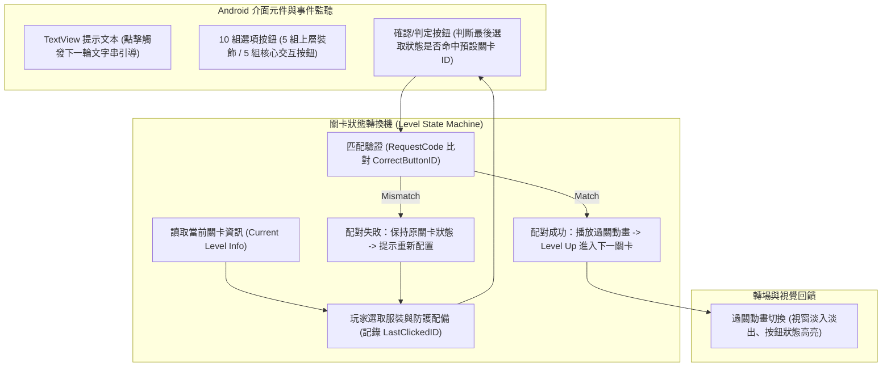

# 📱 CAPSTONE-01-ANDROID-HEALTH-APP-DEMO 專題實作成果發表：Android 醫療互動遊戲 App 架構、關卡邏輯與UI事件控制

> **發表主題**：資訊管理系畢業專題成果發表、Android 醫療衛教互動遊戲 App 開發實務、UI 事件驅動與狀態機邏輯  
> **專案發表**：專題開發組員（專題學生）  
> **核心模組**：Android SDK, State Machine, UI Event Handling, Level Progression, Animation Transitions  
> **學習目標**：精熟 Android 生命週期事件處理、按鈕狀態比對防呆機制與動態遊戲關卡架構設計  
> **關聯文件**：[📄 完整原話逐字稿 (20240606-Android醫療互動遊戲App架構與關卡控制.full.md)](./20240606-Android醫療互動遊戲App架構與關卡控制.full.md)

---

## 🏛️ Android 互動 App 介面事件驅動與關卡狀態轉換架構

---

## 🎯 核心重點整理 (Key Takeaways)

### 1. Android 互動關卡狀態機（State Machine）設計
- **關卡狀態讀取與初始化**：Activity/Fragment 載入時動態讀取當前關卡參數（如關卡編號、目標服裝 ID、文字說明序列）。
- **雙態按鈕事件處理**：採用單一選擇狀態記錄器（`lastSelectedButtonId`），避免多選衝突；設計防呆機制（上層無效裝飾按鈕點擊不觸發成功判定）。
- **狀態判定與流轉**：按下確認後比對 `lastSelectedButtonId == targetLevelId`；成功時觸發回呼更新資料並調用 `startActivityForResult` / Intent 傳遞關卡晉級參數。

### 2. UI 互動體驗與動態文本推進
- **TextView 動態文字步進**：透過陣列索引追蹤劇情對話，點擊即時更新下一句對白，直到完整引導完畢才啟用（`setEnabled(true)`）核心操作按鈕。
- **視覺動畫回饋**：關卡通過時疊加動畫過渡效果，提升使用者衛教互動之趣味性與沉浸感。
