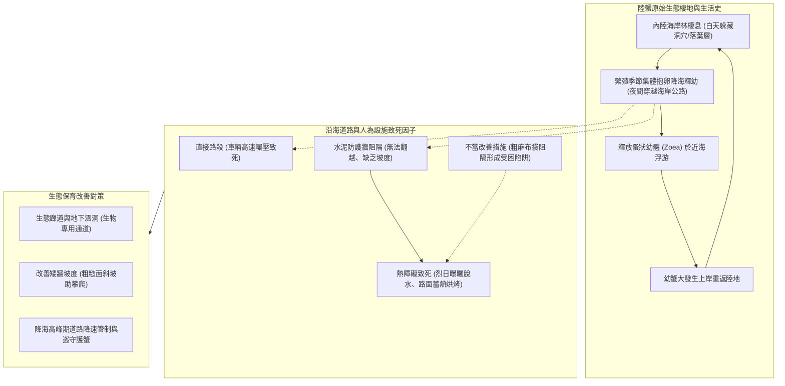

# 🦀 ECOL-01-LAND-CRAB-ROADKILL-SURVEY 自然生態觀察社：恆春墾丁海岸陸蟹生態調查與道路阻隔熱障礙分析

> **活動主題**：自然生態觀察社墾丁海岸陸蟹生態調查、道路路殺現況與水泥阻隔熱致死衝擊評估  
> **領隊主持**：生態導師 / 社團社長（自然生態觀察社）  
> **核心模組**：Land Crab Migration, Coastal Roadkill, Habitat Fragmentation, Thermal Stress, Conservation Ecology  
> **學習目標**：深入掌握台灣南部海岸陸蟹生活史、量化評估道路工程對野生動物之阻隔與熱障礙衝擊  
> **關聯文件**：[📄 完整原話逐字稿 (20240511-恆春墾丁海岸陸蟹生態調查與道路阻隔分析.full.md)](./20240511-恆春墾丁海岸陸蟹生態調查與道路阻隔分析.full.md)

---

## 🏛️ 陸蟹降海生活史與道路生態阻隔危機模型

---

## 🎯 核心重點整理 (Key Takeaways)

### 1. 陸蟹降海釋幼之生活史危機
- **繁殖降海需求**：每年農曆十五前後月圓夜間，海岸林中抱卵母蟹必須橫越沿海道路前往潮間帶與近海釋放蚤狀幼體。
- **沿海公路雙重威脅**：
  - **車輛直接路殺（Roadkill）**：高速行駛車輛致死率極高。
  - **水泥護欄與熱障礙（Thermal Barrier）**：道路兩側垂直水泥擋土牆阻斷母蟹返林路徑，黎明太陽升起後路面及麻布袋急遽升溫（可達 40°C~50°C），導致數十隻幼蟹與母蟹因嚴重脫水熱衰竭死亡。

### 2. 人為生態補償工程之檢討
- **麻布袋攀爬設施盲點**：原本旨在協助陸蟹翻越垂直牆體的麻布袋，若缺乏遮蔭與水分，常反被陸蟹誤視為陰涼庇護所而聚集躲入，日光直射後成為致命的集體烘烤陷阱。
- **改善建言**：應採用地下微型生態通道（Micro-Culverts）、改良斜坡粗糙生態矮牆，並配合降海尖峰期（夏季農曆七至九月）實施夜間道路封閉與志工護蟹巡守。
