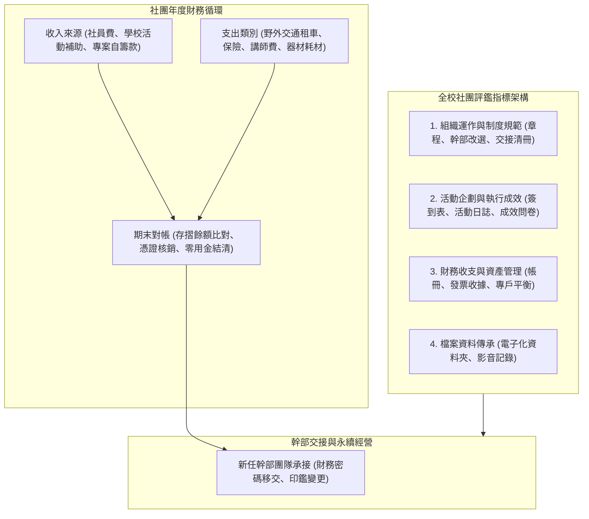

# 📊 ECOL-02-ANNUAL-EVALUATION-FINANCIAL-REVIEW 自然生態觀察社：112學年度社團評鑑、年度財務收支結算與傳承檢討

> **會議主題**：自然生態觀察社 112 學年度社團評鑑指標盤點、年度財務收支帳冊核對與幹部交接  
> **主持幹部**：社長 / 財務長（自然生態觀察社）  
> **核心模組**：Club Evaluation Standards, Financial Auditing, Activity Archiving, Officer Handover  
> **學習目標**：掌握大學社團法規評鑑流程、建立標準化單據核銷制度與健全組織永續營運架構  
> **關聯文件**：[📄 完整原話逐字稿 (20240608-01-社團評鑑與財務收支結算研討.full.md)](./20240608-01-社團評鑑與財務收支結算研討.full.md)

---

## 🏛️ 社團評鑑四維度與財務循環架構

---

## 🎯 核心重點整理 (Key Takeaways)

### 1. 全校社團評鑑準備規範
- **評鑑四維度**：組織運作、活動企劃與執行成效、財務管理、以及傳承檔案建置。
- **佐證資料嚴謹性**：每次野外考察均需備齊完整企劃書、簽到名冊、平安保險單據、活動照片紀錄與滿意度問卷統計。

### 2. 年度財務結算與單據核銷
- **帳冊與存摺餘額一致性**：期末對帳必須嚴格核對社團郵局/銀行帳戶結餘，確保每一筆支出均具備合格之統編發票或免用統一發票收據。
- **自籌款與補助款分流**：社員繳交之活動自籌款與學校課活組核撥之補助款須分科記帳，保障帳目公開透明。
