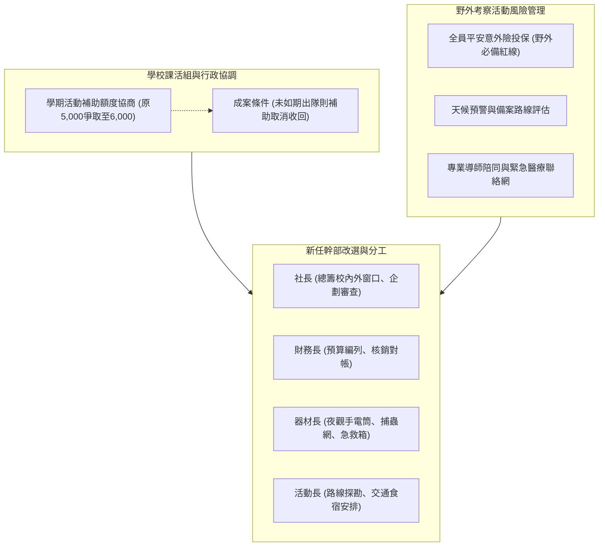

# 🌿 ECOL-03-OFFICER-HANDOVER-ACTIVITY-DEBRIEF 自然生態觀察社：社團幹部改選、學校補助款協調與野外考察活動覆盤

> **會議主題**：自然生態觀察社幹部改選、學校課活組補助款協調與野外生態考察風險管理覆盤  
> **主持幹部**：社長 / 幹部群（自然生態觀察社）  
> **核心模組**：Officer Re-election, University Subsidy, Field Safety Protocol, Risk Management  
> **學習目標**：建立社團幹部權責矩陣、健全野外高風險活動應變SOP與提升行政協調能力  
> **關聯文件**：[📄 完整原話逐字稿 (20240608-02-幹部改選與野外活動執行檢討.full.md)](./20240608-02-幹部改選與野外活動執行檢討.full.md)

---

## 🏛️ 社團幹部分工與野外活動安全管控體系

---

## 🎯 核心重點整理 (Key Takeaways)

### 1. 學校補助款之申請機制與風險
- **補助款門檻**：學校課活組每學期針對常態社團核發基本活動補助（約 5,000~6,000 元）；若預定之野外活動因故未能如期舉辦，該筆專款即無法請領核銷。
- **課活組溝通管道**：幹部須積極與活動輔導員建立信任與常態溝通，提前備妥備案企劃以防天候等不可抗力因素導致預算落空。

### 2. 野外考察安全防護與幹部分工
- **意外保險為絕對紅線**：舉凡夜間觀察、高山森林考察，出發前必須全額完成全員旅遊平安險與意外傷害險投保。
- **新任幹部分工確立**：社長統領對外行政窗口、財務長掌管帳務核銷、器材長維護夜觀高流明照明與急救裝備、活動長負責交通車次與前置路勘。
