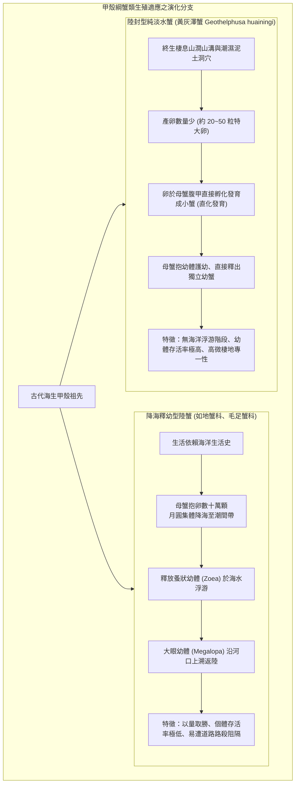

# 🦀 ECOL-02-NIGHT-SURVEY-GEOTHELPHUSA-HUAININGI 自然生態觀察社：夜間野外生態觀察與黃灰澤蟹物種調查

> **活動主題**：自然生態觀察社夜間野外生態調查、黃灰澤蟹（*Geothelphusa huainingi*）掘穴生態與兩棲爬蟲物種辨識  
> **領隊主持**：生態導師 / 社長（自然生態觀察社）  
> **核心模組**：Night Field Survey, Geothelphusa huainingi, Land-locked Reproduction, Amphibian Identification, Habitat Conservation  
> **學習目標**：掌握陸蟹與澤蟹生殖策略之演化差異（降海釋幼 vs. 陸封抱卵護幼），熟練夜間野外兩棲類與節肢動物之型態辨識技巧  
> **關聯文件**：[📄 完整原話逐字稿 (20241002-夜間野外生態觀察與黃灰澤蟹物種調查.full.md)](./20241002-夜間野外生態觀察與黃灰澤蟹物種調查.full.md)

---

## 🏛️ 陸蟹降海釋幼 vs. 澤蟹陸封生殖之演化適應模型

---

## 🎯 核心重點整理 (Key Takeaways)

### 1. 陸蟹與澤蟹之演化及生殖策略比較
- **降海釋幼型陸蟹（Marine-dependent Land Crabs）**：
  - 產卵數達數萬至數十萬顆，繁殖季節必須跨越海岸道路前往海邊釋幼。
  - 幼體必須在海洋中經過「蚤狀幼體（Zoea）」及「大眼幼蟹（Megalopa）」等浮游變態階段，再由河口溯溪上陸，易面臨棲地破碎化與人為路殺威脅。
- **陸封型澤蟹（Land-locked Freshwater Crabs - *Geothelphusa*）**：
  - 以**黃灰澤蟹**為代表，屬於完全適應淡水與陸域潮濕環境的陸封型物種。
  - **高親代撫育（Maternal Care）**：抱卵數通常僅 20 至 50 粒，卵徑較大、富含卵黃。幼蟹跳過浮游期直接在母體腹甲下孵化，由母蟹庇護直至能獨立行走取食，存活率顯著高於海放釋幼型。

### 2. 夜間野外兩棲與節肢動物辨識要點
- **黃灰澤蟹（*Geothelphusa huainingi*）**：
  - 掘穴深度可達數十公分，洞口常有翻出之新鮮濕潤泥球；夜間出洞於落葉層或泥質斜坡覓食。
  - 公母辨識：腹甲呈尖三角形為公蟹；腹甲呈寬圓形（用於抱卵）為母蟹。
- **樹蛙與蟾蜍型態鑑別**：
  - **斑腿樹蛙**：腿部具明顯網狀深褐色花紋，背部具 X 或十字紋，喉下具鳴囊；外來入侵種需密切監控擴散趨勢。
  - **澤蛙 / 蛇蛙**：背部中央常具金色金屬脊線（亦有無背中線個體），皮膚具許多長短不一的棒狀膚褶，無耳後腺，體型粗糙類似幼年黑框蟾蜍。
- **昆蟲幼體與蜘蛛**：
  - **油葫蘆幼蟲**：直翅目蟋蟀科，體態靈敏，夜間常於草叢根部躍動。
  - **天蛾幼蟲（天線寶寶）**：體尾端具有特化尖銳刺狀尾角（Anal Horn），懸掛於絲線或植物莖葉背面。
  - **白額高腳蛛（旯犽）**：大型遊獵型蜘蛛，夜間於樹幹與岩壁迅捷捕食昆蟲。

### 3. 夜間生態觀察倫理與安全準則
- 觀察時應避免手電筒持續強光直射兩棲動物雙眼，防止對其感光系統造成視覺盲損。
- 輕取觀察後務必將石頭、落葉與個體**原位放回**，維護微棲地濕度與隱蔽完整性。
