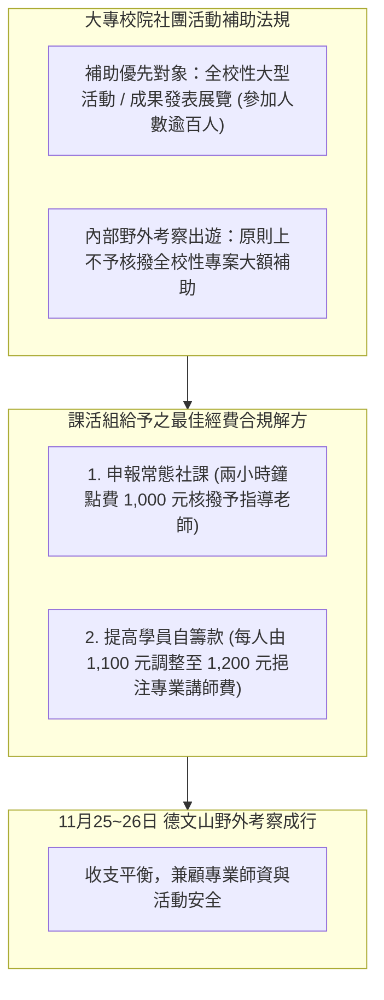

# 🏔️ ECOL-04-DEWENSHAN-BUDGET-CONSULTATION 自然生態觀察社：德文山野外考察活動經費企劃與課外活動組法規諮詢

> **諮詢主題**：自然生態觀察社德文山野外考察經費籌措、學校課活組補助要件與自籌款定價合規諮詢  
> **對談人員**：社長 / 社團幹部、學校課外活動組承辦老師  
> **核心模組**：Extracurricular Subsidy Regulation, Club Budgeting, Field Trip Planning, Honorarium  
> **學習目標**：精熟大專院校社團活動補助法規邊界、掌握行政與自籌雙軌預算編列技巧  
> **關聯文件**：[📄 完整原話逐字稿 (20241030-德文山野外考察活動經費企劃與課活組諮詢.full.md)](./20241030-德文山野外考察活動經費企劃與課活組諮詢.full.md)

---

## 🏛️ 社團野外考察經費合規申請路徑圖

---

## 🎯 核心重點整理 (Key Takeaways)

### 1. 學校社團活動補助款審查法規
- **補助條件**：學校課活組資源優先補助「全校性參與之公開活動」（如全校攝影展、公開學術講座）或跨社團大型成果發表會，且參與規模需達一至兩百人以上。
- **小型考察限制**：純社團內部或單一系所之野外考察出遊，無法以專案形式申請高額專款補助。

### 2. 德文山野外考察之經費雙軌解方
- **校內行政補助申報途徑**：將考察活動中之定點解說列為「常態社課」，向生動組/課活組申領標準社課鐘點費（每小時 500 元，兩小時共 1,000 元）。
- **自籌款定價策略**：原定學員收費每人 1,100 元，承辦老師建議微幅調整為 1,200 元，將增額之 100 元直接作為外聘專業野外講師之鐘點補貼，達成預算平衡與合法合規。
