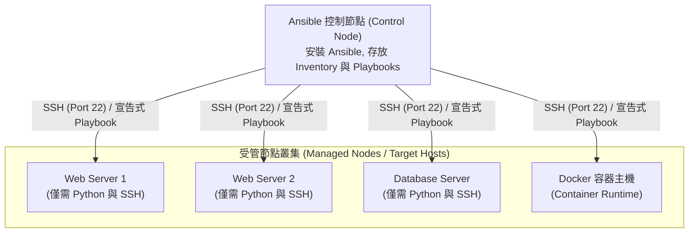
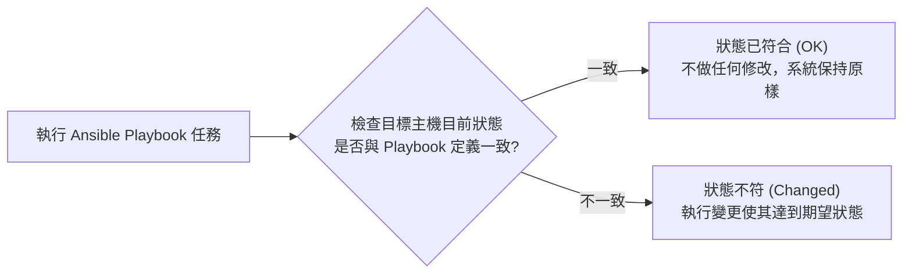

# 🛡️ DEVOPS-01-ANSIBLE-AUTOMATION DevOps 自動化維運實務 Lesson 01：Ansible 無代理架構、Playbook 宣告式部署與 Docker 容器整合

> **課程主題**：Ansible 自動化組態管理、無代理架構（Agentless）、Playbook 語法、冪等性與容器化維運  
> **授課教授**：授課講師（系統架構授課教授）  
> **核心模組**：Ansible Architecture, Agentless SSH, Playbook YAML, Idempotency, Docker Deployment  
> **學習目標**：掌握 Ansible 基礎架構原理，理解宣告式語法與冪等性對大規模基礎架構維運（IaC）之關鍵價值  
> **關聯文件**：[📄 完整原話逐字稿 (2025-12-09-01-Ansible無代理架構與Playbook部署-proofread.md)](./2025-12-09-01-Ansible無代理架構與Playbook部署-proofread.md)

---

## 🏛️ Ansible 無代理 (Agentless) 自動化部署拓撲

---

## ⚙️ 冪等性 (Idempotency) 與宣告式狀態維護模型

---

## 🎯 核心重點整理 (Key Takeaways)

### 1. Ansible 的四大核心技術特色
- **無代理架構 (Agentless)**：受管主機端完全不需要預先安裝專屬 Agent 或啟動背景守護程式（Daemon），僅需標準 OpenSSH 服務與 Python 直譯器即可受控。
- **宣告式 Playbook (YAML)**：以清晰結構化之 YAML 檔案描述基礎架構的「最終期望狀態（Desired State）」，而非傳統指令碼的程序式指令（Imperative Commands）。
- **冪等性 (Idempotency)**：重複執行相同的 Playbook 任意多次，系統狀態將始終保持一致且不會造成副作用或重複安裝錯誤。
- **豐富模組生態**：內建包含套件管理（apt/yum）、檔案模板（template/jinja2）、服務管理（systemd）、Docker/Kubernetes 等數千種官方模組。

### 2. 容器化環境與 Inventory 動態管理
- **Docker 整合**：透過 Ansible Docker 模組實現容器映像檔自動建置、環境變數注入與叢集服務編排。
- **AI 輔助維運指令碼生成評估**：小組專題探討利用本地大型語言模型生成自動化維運 YAML 指令碼，但需嚴防模型「幻覺（Hallucination）」所造成的無效指令或資安組態漏洞。
