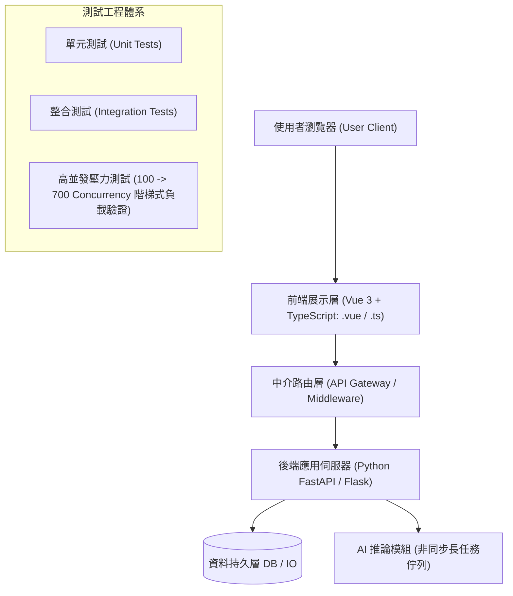

# 🛡️ SE-FINAL-PROJECT 軟體工程期末專案發表與評審審查會：Vue/TS 前端、Python 後端、高並發壓力測試與 AI 模組整合

> **課程主題**：軟體工程（Software Engineering）期末專案發表、UML 循序圖重構、高並發壓力測試與 AI 模組實作  
> **指導評審**：授課講師（軟體工程授課教授）  
> **發表團隊**：專案開發團隊學員群  
> **核心模組**：Software Architecture, UML Sequence Diagrams, Stress Testing (700 Concurrency), AI Module Integration  
> **學習目標**：實踐完整 SDLC 軟體生命週期、完成前後端架構解耦、量化負載極限並通過現場答辯  
> **關聯文件**：[📄 完整原話逐字稿 (2025-12-17-期末專題架構循序圖與高並發壓測-proofread.md)](./2025-12-17-期末專題架構循序圖與高並發壓測-proofread.md)

---

## 🏛️ 核心架構與概念流轉圖

---

## 🔑 重點提要 (Key Takeaways)

1. **架構分層與循序圖重構**：團隊將原本直連後端的架構重構為包含中介層（Middleware）的多層架構，並在 UML 循序圖中完整體現 Vue 前端、TypeScript 模組與 Python 後端的交互時序。
2. **高並發壓力測試（Stress Testing）**：透過自動化腳本進行階梯式壓力測試。系統在 100 並行請求時維持 100% 成功率；當攀升至 700 Concurrency 時暴露資料庫連線池與 AI 推論延遲瓶頸，為後續效能調校提供確切數據。
3. **AI 時代的軟工素養**：授課教授在講評中強調，生成式 AI 工具極大加速了寫 code 速度，但系統設計架構力、測試驗證嚴謹度與對底層錯誤的排查能力，才是軟體工程師的核心價值所在。
