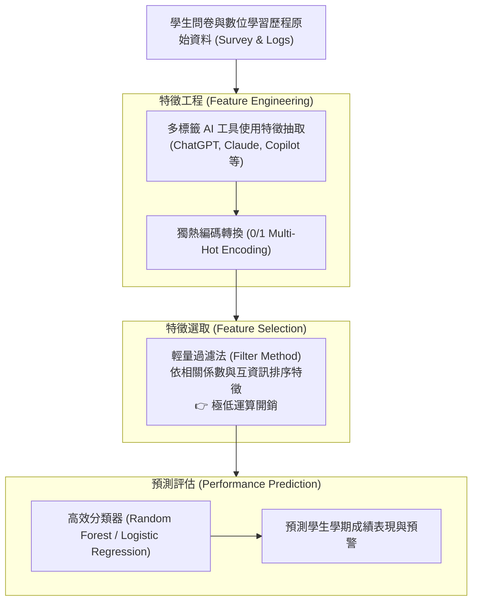

# 🛡️ AI-EDU-ENGLISH-PRESENTATION 英語專題發表：人工智慧教育表現預測、特徵工程與低成本過濾法模型

> **專題發表主題**：AI 在教育學習表現預測之特徵工程（Feature Engineering）、多標籤獨熱編碼與輕量級過濾法（Filter Method）模型  
> **發表團隊**：Youchen 研究專案團隊（400th Day Request 專題小組）  
> **核心模組**：Educational Data Mining, Feature Selection, Filter Method, Multi-Label Encoding, Low-Cost ML  
> **學習目標**：掌握教育大數據中多模態學習工具使用特徵之編碼方式，運用低運算成本之過濾法特徵選取優化學習成效預測  
> **關聯文件**：[📄 完整原話逐字稿 (2026-03-18-AI教育表現特徵工程與過濾法預測-proofread.md)](./2026-03-18-AI教育表現特徵工程與過濾法預測-proofread.md)

---

## 🏛️ 教育大數據特徵工程與過濾法預測管線

---

## 🎯 核心重點整理 (Key Takeaways)

### 1. 研究主題與教育範式轉移 (Paradigm Shift)
- **生成式 AI 工具融入學習**：探討現代大學生在學習歷程中使用各類 AI 輔助工具（如 ChatGPT）對學業表現之實際衝擊。
- **多標籤特徵表示**：學生可能同時使用多種 AI 工具，團隊透過多標籤編碼（0 與 1 二元矩陣）精確記錄其工具使用組合特徵。

### 2. 過濾法 (Filter Method) 之實務優勢
- **極低算力成本**：相較於包裹法（Wrapper Method）或嵌入法（Embedded Method）需要反覆訓練模型，過濾法僅需計算特徵與目標變數之統計相關性，運算成本極低，能推動 AI 教育預測工具的普及化。
