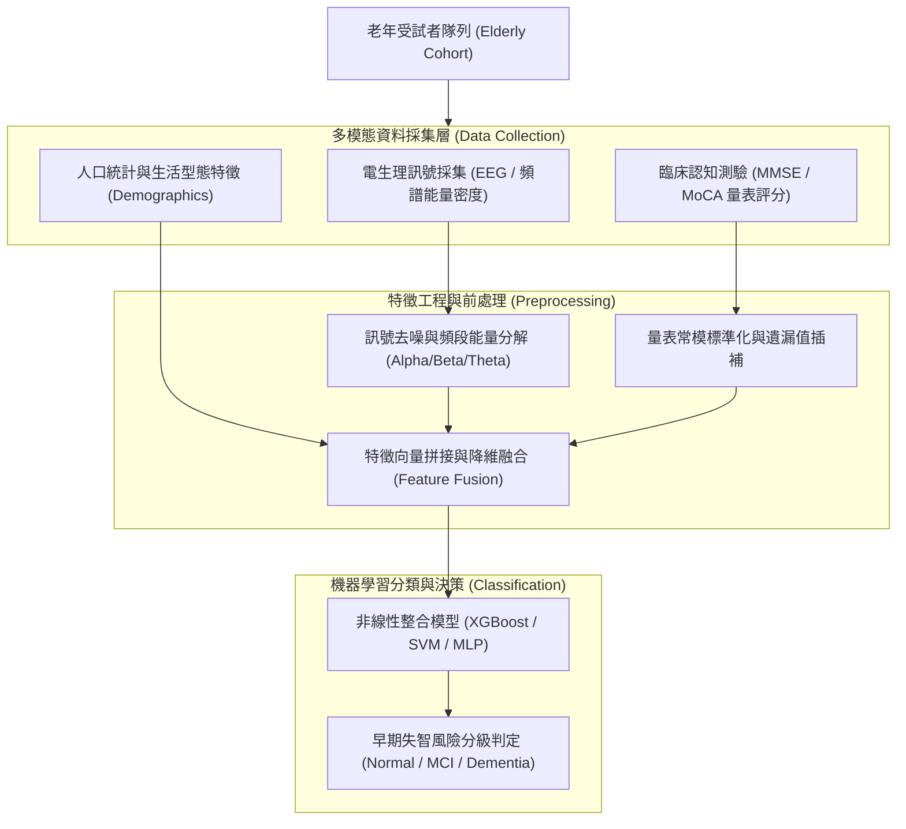

# 🛡️ NCU-IM-01-SMART-HEALTHCARE-DEMENTIA 學術論文發表 Session A：智慧醫療——老年失智症多模態神經與認知特徵預測模型

> **研討會名稱**：第十七屆國立中央大學資訊管理學系學術論文暨專題發表會 (NCU IM Conference 2026)  
> **發表場次**：Session A 智慧醫療專題  
> **核心模組**：Smart Healthcare, Dementia Prediction, Multimodal Features, Cognitive Assessment, Model Evaluation  
> **研究亮點**：整合多模態神經電生理訊號與臨床認知評估量表，構建高靈敏度之早期老年失智症輔助預測架構  
> **關聯文件**：[📄 完整原話逐字稿 (2026-03-27-NCU-IM-01-智慧醫療失智症預測-proofread.md)](./2026-03-27-NCU-IM-01-智慧醫療失智症預測-proofread.md)

---

## 🏛️ 多模態失智症早期篩檢特徵工程架構

---

## 🎯 核心重點整理 (Key Takeaways)

### 1. 研究動機與臨床挑戰
- **高齡化社會痛點**：失智症（Dementia）為神經退化性症候群，早期輕度認知障礙（MCI）若能提早偵測，可大幅延緩病程惡化。傳統醫院神經心理量表耗時長且仰賴資深醫師主觀判讀。
- **多模態特徵整合**：本研究結合客觀生理訊號（腦波 EEG 頻段特徵）與結構化認知量表，降低單一檢驗指標之偽陽性。

### 2. 實驗效能與評審委員講評
- **指標權衡**：在生醫診斷領域中，「靈敏度（Sensitivity / Recall）」高於特異度（Specificity），需確保不漏診潛在患者。
- **評審建議**：模型應進一步驗證不同年齡組群與跨院區資料之泛化能力，並朝向穿戴式輕量化設備推展。
