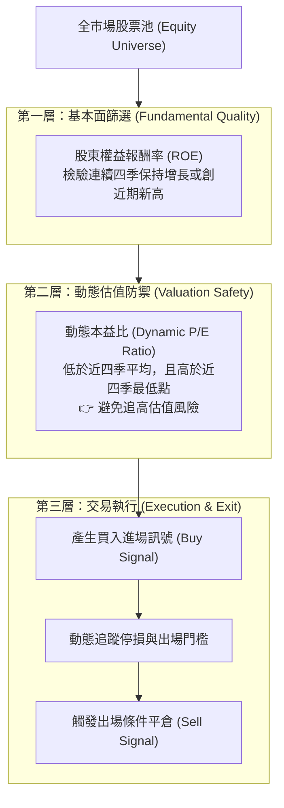

# 🛡️ NCU-IM-02-FINTECH-QUANT-INVESTING 學術論文發表 Session H：智慧金融——量化投資多因子選股與動態本益比進出場策略

> **研討會名稱**：第十七屆國立中央大學資訊管理學系學術論文暨專題發表會 (NCU IM Conference 2026)  
> **發表場次**：Session H 智慧金融專題  
> **核心模組**：FinTech, Quantitative Investing, Multi-Factor Model, ROE Dynamics, PE Thresholds, Backtesting  
> **研究亮點**：建構結合獲利能力動態趨勢（ROE）與市場估值門檻（動態本益比）之自動化選股與進出場交易決策系統  
> **關聯文件**：[📄 完整原話逐字稿 (2026-03-27-NCU-IM-02-智慧金融量化選股策略-proofread.md)](./2026-03-27-NCU-IM-02-智慧金融量化選股策略-proofread.md)

---

## 🏛️ 量化多因子選股與動態進出場決策邏輯

---

## 🎯 核心重點整理 (Key Takeaways)

### 1. 動態多因子模型架構
- **時間段動態對比 vs. 單一時間點**：傳統價值投資常僅比對單一季度的財務比率，本系統將指標擴展為「近四季滾動時間段（Rolling 4 Quarters）」，檢視公司體質之動態連續性。
- **市場估值防禦機制**：透過疊加動態本益比門檻，有效剔除受市場短期題材過度炒作之泡沫標的。

### 2. 系統架構與使用者體驗
- **黑盒子封裝與直覺化介面**：後端處理極為複雜的跨期財報清洗、因子權重計算與回測演算法，但前端提供直觀的視覺化圖表與簡潔進出場訊號，降低一般非量化投資人之使用門檻。
