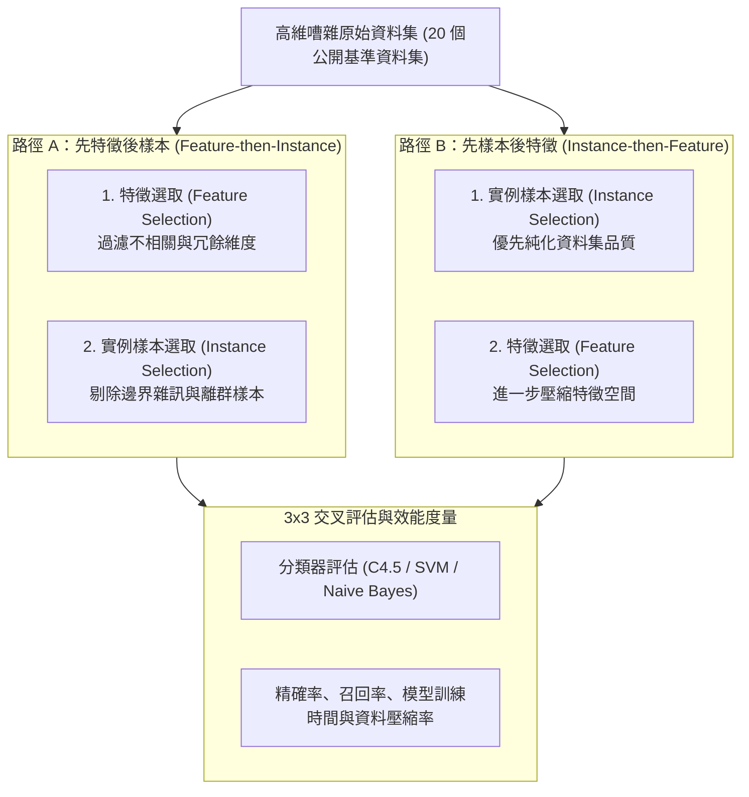

# 🛡️ NCU-IM-03-ML-FEATURE-INSTANCE-SELECTION 學術論文發表 Session I：機器學習——特徵精簡與實例樣本選取雙向管線效能優化

> **研討會名稱**：第十七屆國立中央大學資訊管理學系學術論文暨專題發表會 (NCU IM Conference 2026)  
> **發表場次**：Session I 機器學習與資料探勘專題  
> **評審委員**：歐陽崇榮教授（南洋大學 / 專案特聘評審）  
> **核心模組**：Machine Learning, Feature Selection, Instance Selection, Pipeline Optimization, Benchmark Datasets  
> **研究亮點**：系統性探討特徵選取（橫向維度精簡）與實例樣本選取（縱向樣本過濾）之執行順序對模型分類效能與穩定度之影響  
> **關聯文件**：[📄 完整原話逐字稿 (2026-03-27-NCU-IM-03-機器學習特徵精簡管線-proofread.md)](./2026-03-27-NCU-IM-03-機器學習特徵精簡管線-proofread.md)

---

## 🏛️ 雙向資料前處理流水線 (Bi-Directional Pipeline) 實驗設計

---

## 🎯 核心重點整理 (Key Takeaways)

### 1. 特徵選取 (FS) 與實例選取 (IS) 之交互影響
- **橫向 vs. 縱向精簡**：特徵選取（FS）縮減屬性維度（Columns），降低模型複雜度；實例選取（IS）縮減訓練樣本數（Rows），移除雜訊資料與邊界模糊實例。
- **流水線執行先後順序**：
  - **路徑 A（FS $	o$ IS）**：在低維度空間中計算樣本距離與代表性，大幅降低 IS 演算法之運算時間，並提升代表性樣本選取之準確度。
  - **路徑 B（IS $	o$ FS）**：先淨化樣本分佈以確保特徵重要度評估不受極端離群值扭曲。

### 2. 嚴謹的實驗設計
- **20 個公開 Benchmark 資料集**：橫跨不同特徵維度、樣本規模與類別平衡度，避免演算法結論偏向特定領域資料集。
- **3 $	imes$ 3 實驗設計**：各採用三種代表性 FS 演算法與三種 IS 演算法進行全組合驗證，確保實證結論之穩健性。
