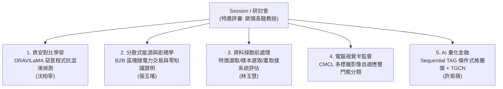
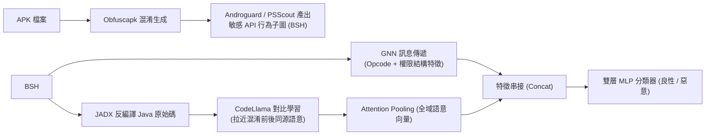
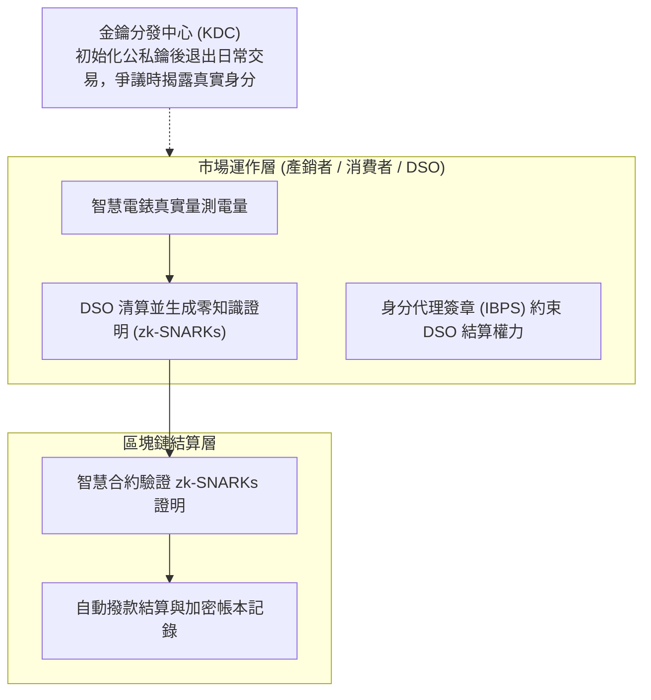
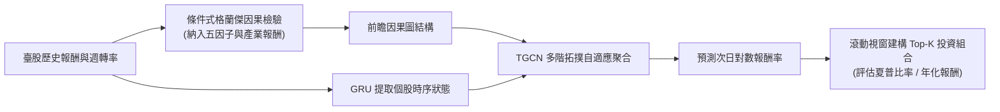

# 📊 研討會精華筆記：Session I 評審專題（歐陽長龍教授場次）

> **研討會場次**：技術學術研討會 Session I（教室 I202）  
> **特邀評審委員**：歐陽長龍教授（南洋大學 / 國立臺灣大學）  
> **發表陣容**：
> 1. 沈柏寧（指導：陳奕明博士）—— 《DRAVILaMA：對比學習微調大型語言模型結合圖結構提升 Android 惡意程式偵測之抗混淆能力》
> 2. 張玉瑤（指導：葉偉陽博士）—— 《B2B 電力量測與交易市場之公司認證在區塊鏈上的拓展方案》
> 3. 林玉慧（指導：蔡志豐博士）—— 《多策略資料前處理之研究：結合特徵選取、樣本選取與重取樣方法》
> 4. 研究生（指導：蔡志豐博士）—— 《基於半監督學習之多標籤影像分類研究》
> 5. 許紫薇（指導教授群）—— 《Sequential TAG 條件式格蘭傑因果圖與拓撲自適應圖卷積於臺灣股市投資組合建構之應用》

---

## 🏛️ Session I 五大專題架構圖解

---

## 🛡️ 專題一：DRAVILaMA 惡意程式抗混淆偵測 (沈柏寧)

### 1. 痛點與研究動機
- **Android 混淆攻擊威脅**：Android 全球市佔率逾 68%，高達 80% 惡意程式使用混淆技術（Obfuscation）。傳統基於函式呼叫圖（FCG）與圖神經網路（GNN）的方法，在面對反射呼叫（Reflection）與控制流改寫時拓撲結構劇烈變更，偵測率大幅下降。
- **LLM 與圖結構互補**：未經混淆微調的原生 LLM 對混淆改寫極為脆弱，因此需要引入對比學習引導 LLM 學習「語意不變性（Semantic Invariance）」。

### 2. 系統架構

### 3. 歐陽長龍教授講評重點
- **初步成效**：混淆後傳統方法偵測率跌破 80%，DRAVILaMA 結合微調 LLM 能維持在 86%~89%。
- **實務建議**：資安實務最看重「準確率」與「效率（Efficiency）」，大型語言模型參數量大，必須在實驗中揭露推論時間開銷，兼顧偵測準確度與掃描速度。

---

## ⚡ 專題二：B2B 電力量測與交易市場之公司認證區塊鏈方案 (張玉瑤)

### 1. 綠電市場四大挑戰
- **隱私洩露**：智慧電錶數據揭露企業排程與用電機密；
- **交付偏差**：再生能源間歇性導致承諾量與實際發電量不一致；
- **責任追溯難題**：DSO（配電運營商）清算爭議需具備事後不可否認性；
- **整合架構缺失**：現有方案無法同時兼顧隱私、自動清算與責任追溯。

### 2. 三層技術架構

### 3. 歐陽長龍教授講評重點
- **台電智慧電網試點結合**：指出台電內部正積極推進智慧電網與綠電交易市場試點，建議張同學參考台電報告，將實際電網輸配、市場規模與法規痛點納入分析，爭取未來產學合作機會。

---

## 🧹 專題三：多策略資料前處理之研究 (林玉慧，指導：蔡志豐博士)

### 1. 研究核心問題
- **前處理影響度**：單一前處理方法（特徵選取 vs. 樣本選取）對分類器上限之影響；
- **平行與序列混合策略**：探討 CFS、GA、MI 特徵選取與 CNN、ENN、GA 樣本選取的最佳協同機制。

### 2. 實驗發現與結論
- **跨維度實驗**：精選 20 個標準資料集（涵蓋 10 至 10,000+ 維度），43 組方法交叉比對；
- **關鍵發現**：
  1. **特徵選取平行多重交集最優**：在高特徵精簡率下，顯著優於 Baseline，兼顧降維與準確率；
  2. **樣本選取容易過度刪減**：單純樣本選取或序列式方法容易導致關鍵邊界資訊流失，效能反而下降。
- **評審建議**：歐陽教授肯定前處理研究的基石價值與嚴謹統計檢驗；期待實驗二結合 SMOTE 重取樣技術以克服樣本選取的缺陷。

---

## 🖼️ 專題四：基於半監督學習之多標籤影像分類研究 (指導：蔡志豐博士)

### 1. 技術痛點
- 多標籤影像中正負樣本極度不均衡（如 80 類中僅 2-3 個正類）；未標籤樣本的偽標籤噪聲易放大確認偏差；固定門檻難以適應不同類別分佈。

### 2. CMCL 核心設計
1. **Teacher-Student 雙架構**：動態維護類別特徵中心；
2. **非對稱損失（Asymmetric Loss, ASL）**：強力抑制簡單負樣本的梯度干擾；
3. **類別自適應雙門檻（Class-Specific Dual Threshold）**：為各類別獨立計算正負門檻，避免模糊樣本硬切；
4. **原型對比學習（Prototype Contrastive Learning）**：將高信心特徵拉近理想類別原型。
- **評審交流**：討論 RTX GPU 運算資源配置與動態門檻對避免分類混淆（如相簿自動分類）的實務價值。

---

## 📈 專題五：Sequential TAG 條件式格蘭傑因果圖與 TGCN 於臺股投資組合 (許紫薇)

### 1. 理論突破與模型設計
- **消除偽因果**：在格蘭傑檢驗中引入 Fama-French 五因子與產業報酬因子作為條件控制，剔除整體大盤共同影響，提取真實前瞻因果關係；
- **解決 GNN 過度平滑（Over-smoothing）**：傳統 GCN 堆疊多層會導致節點表徵指數趨同；TGCN 採用多階可調距離加法聚合機制，在單層即可聚合跨 Hop 鄰居，保留個股獨特表徵。

### 2. 預測流程

### 3. 歐陽長龍教授講評重點
- **結合臺股產業特性**：建議針對臺灣以「電子半導體」與「金融」為核心的板塊進行獨立因果檢驗；
- **實務基準對標**：建議將預測投組與臺灣 50（0050）及熱門高股息 ETF（0056、00878）對比，驗證能否在實務上獲取穩定超額 Alpha。

---

## 🏆 大會閉幕與頒獎合影

- 致贈特邀評審歐陽長龍教授感謝狀。
- 發表學生代表全體登臺與歐陽教授合影留念（「二一笑一個」、「耶」、「俏皮一點」）。
- 司儀宣布優秀論文名單公布於系網頁與公告欄，Session I 圓滿閉幕。
