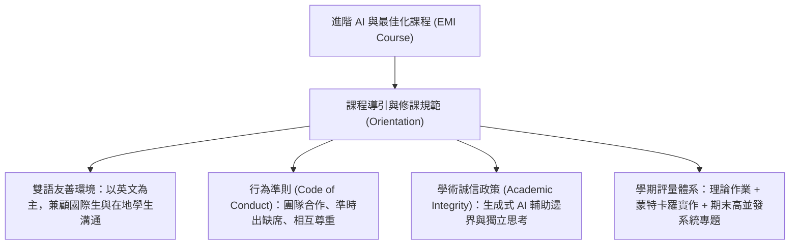

# 🛡️ AI-OPT-01 進階人工智慧與最佳化 Lesson 01：EMI 全英語課程導論、課堂行為準則與評量規範

> **課程主題**：全英語授課（EMI）導論、課堂行為守則（Code of Conduct）與學術誠信規範  
> **授課教授**：授課講師（AI 與資訊工程領域講座教授）  
> **核心模組**：Course Orientation, Academic Integrity, Grading Policy, EMI Policy  
> **學習目標**：了解跨國學生 EMI 課堂規範、掌握學術誠信底線與學期 AI 最佳化專案要求  
> **關聯文件**：[📄 完整原話逐字稿 (2026-02-26-01-EMI英語課程導論與學術誠信-proofread.md)](./2026-02-26-01-EMI英語課程導論與學術誠信-proofread.md)

---

## 🏛️ 核心架構與概念流轉圖

---

## 🔑 重點提要 (Key Takeaways)

1. **EMI 全英語教學目標**：透過全英文講述與國際生分組協作，建立學員在國際學術研討會與跨國科技產業的專業英文溝通力。
2. **AI 工具輔助準則**：鼓勵使用 AI 提升學習效率，但必須在繳交作業中誠實揭露使用的 Prompt 與模型版本，杜絕直接抄襲生成結果。
