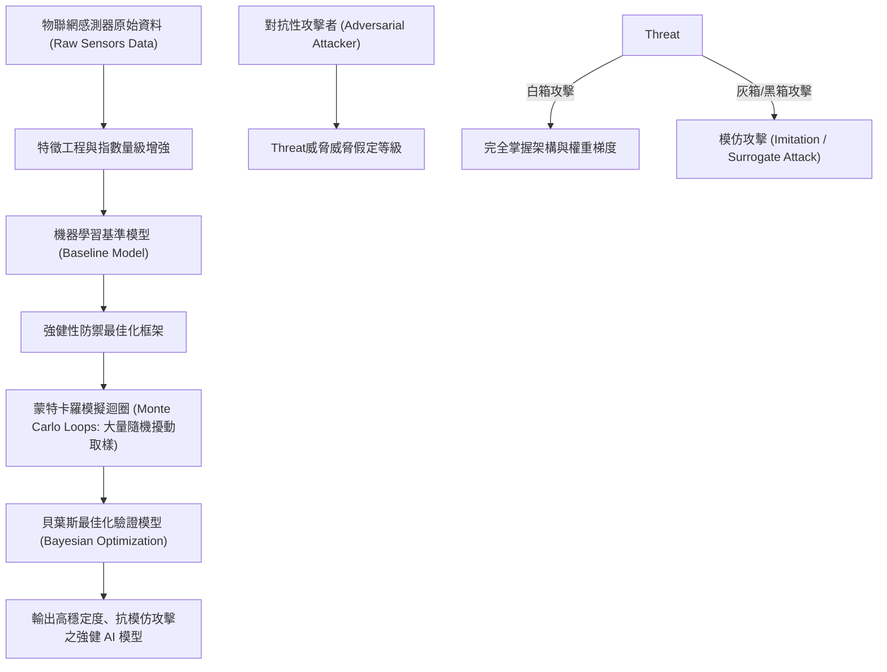

# 🛡️ AI-OPT-02 進階人工智慧與最佳化 Lesson 02：感測器資料模型、對抗性機器學習（Adversarial ML）與蒙特卡羅貝葉斯最佳化

> **課程主題**：感測器特徵工程、對抗性機器學習（Adversarial Machine Learning）、蒙特卡羅迴圈與貝葉斯最佳化  
> **授課教授**：授課講師（AI 與資訊工程領域講座教授）  
> **核心模組**：Adversarial ML, Black/Gray/White Box Threat Models, Monte Carlo Simulation, Bayesian Optimization  
> **學習目標**：理解模型在面對擾動攻擊與模仿攻擊時的脆弱性，設計具備極高穩定性與抗性之驗證模型  
> **關聯文件**：[📄 完整原話逐字稿 (2026-02-26-02-對抗性機器學習與蒙特卡羅最佳化-proofread.md)](./2026-02-26-02-對抗性機器學習與蒙特卡羅最佳化-proofread.md)

---

## 🏛️ 核心架構與概念流轉圖

---

## 🔑 重點提要 (Key Takeaways)

1. **不能盲目依賴黑箱防禦假設**：現實攻防中，攻擊者可藉由查詢輸出訓練代理模型（Surrogate Model）實施高效的遷移性模仿攻擊，模型必須在數學架構上具備內生抗性。
2. **蒙特卡羅與貝葉斯聯手**：透過 Monte Carlo 迴圈生成海量擾動樣本，搭配貝葉斯機率架構動態調整模型超參數，能在有限算力下找到抵禦攻擊之全局最優防護解。
