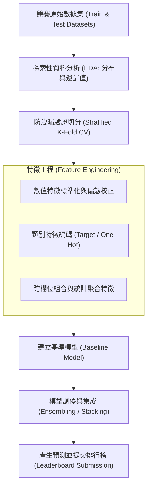

# 🎙️ AI-OPT-02-KAGGLE-PIPELINE 進階人工智慧與最佳化 Lesson 02：Kaggle 競賽流程、團隊分組與機器學習實驗規劃

> **課程主題**：Kaggle 競賽機制、小組團隊建立（3~4人）、資料科學端到端開發管線與實驗設計  
> **日期**：2026-03-05  
> **授課教授**：授課講師（AI 與機器學習領域講座教授）  
> **發表團隊**：資管所全體研一修課學員  
> **核心模組**：Kaggle Pipeline, Cross-Validation, Feature Engineering, Baseline Modeling, Experiment Planning  
> **學習目標**：掌握資料科學競賽專案從團隊組建、題目拆解、資料探勘到建立可復現基準模型之完整工作流程  
> **關聯文件**：[📄 完整雙語原話逐字稿 (20260305-Kaggle競賽流程與團隊實驗規劃.full.md)](./20260305-Kaggle競賽流程與團隊實驗規劃.full.md)

---

## Executive Summary

本篇為國立中央大學資訊管理研究所 114 學年度第二學期 EMI 全英語授課核心課程——**《進階人工智慧與最佳化》（Advanced AI & Optimization）**之雙軌課堂筆記。

本週正式啟動本學期核心實務專案——Kaggle 資料科學機器學習競賽。授課教師要求全班學員於課堂 10 分鐘內透過線上協作表單完成 3~4 人分組與團隊命名。課程詳細拆解了現代資料科學與機器學習的端到端開發管線（Pipeline），強調不可盲目調參，而應建立嚴謹的交叉驗證策略（CV Strategy）防止資料外洩（Data Leakage），並指導學員如何規劃可追蹤的實驗紀錄與假設檢驗流程。

---

## 🏛️ Kaggle 資料科學端到端競賽開發管線

---

## 🎯 核心重點整理 (Key Takeaways)

### 1. 建立乾淨的驗證策略（Validation Strategy）
- 任何競賽與實務專案的第一步都是建立與測試集分布一致的本地驗證集。若本地 CV 與線上 Leaderboard 分數脫鉤，後續所有特徵優化皆將徒勞無功。

### 2. 敏捷團隊分工與實驗版本控管
- 各組成員應分別認領特徵挖掘、模型架構試驗與後處理工作，嚴格記錄每次提交之代碼版本與本地指標，確保模型具備高復現性。
