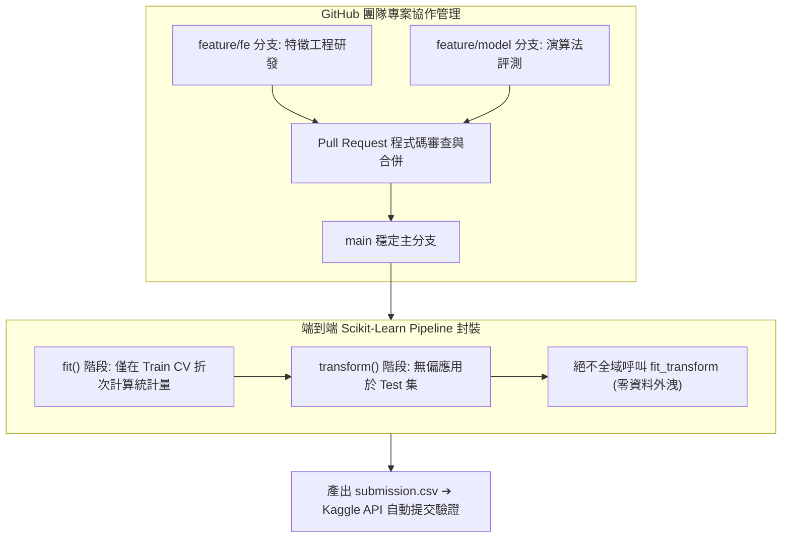

# 🎙️ AI-OPT-03-GITHUB-KAGGLE-PIPELINE 進階人工智慧與最佳化 Lesson 03：GitHub 專案協作、Kaggle 認證與端到端特徵管線實作

> **課程主題**：GitHub 團隊版本庫串接、Kaggle 實名帳號登錄、特徵工程管線與提交驗證  
> **日期**：2026-03-12  
> **授課教授**：授課講師（AI 與機器學習領域講座教授）  
> **發表團隊**：資管所全體研一修課學員  
> **核心模組**：GitHub Workflow, Kaggle Submission, Pipeline Serialization, Data Leakage Prevention  
> **學習目標**：掌握跨人協作的 Git/GitHub 分支管理規範，並完成 Kaggle 競賽線上實名登錄與端到端推論測試  
> **關聯文件**：[📄 完整雙語原話逐字稿 (20260312-GitHub與Kaggle資料科學管線.full.md)](./20260312-GitHub與Kaggle資料科學管線.full.md)

---

## Executive Summary

本篇為國立中央大學資訊管理研究所 114 學年度第二學期 EMI 全英語授課核心課程——**《進階人工智慧與最佳化》（Advanced AI & Optimization）**之雙軌課堂筆記。

本週課程聚焦於現代軟體工程與資料科學研發之基礎設施整合。授課教師逐一核實各小組之 Kaggle 使用者名稱與 GitHub 帳號，指導各團隊建立標準專案結構（包含 data/、src/、notebooks/）與分支協作規範。課堂實戰演示了如何利用 Scikit-Learn Pipeline 封裝預處理與模型訓練流程，確保特徵變換邏輯能嚴格隔離於訓練集內，防止測試資料外洩（Data Leakage），並完成首波基準預測檔生成與線上提交測試。

---

## 🏛️ GitHub 與 Kaggle 整合之特徵工程推論管線

---

## 🎯 核心重點整理 (Key Takeaways)

### 1. 管線序列化與防外洩（Leakage-Proof Pipeline）
- 所有標準化、編碼與缺失值填補器必須以 Pipeline 形式封裝，所有統計參數（如平均數、標準差）僅能由訓練折次計算，嚴禁在分割前對全量數據進行全局操作。

### 2. Git 規範化協作防止程式碼覆蓋
- 小組成員應遵循功能分支（Feature Branch）開發規範，每次提交附帶清楚的實驗描述與指標日誌，避免 Notebook 衝突造成代碼遺失。
