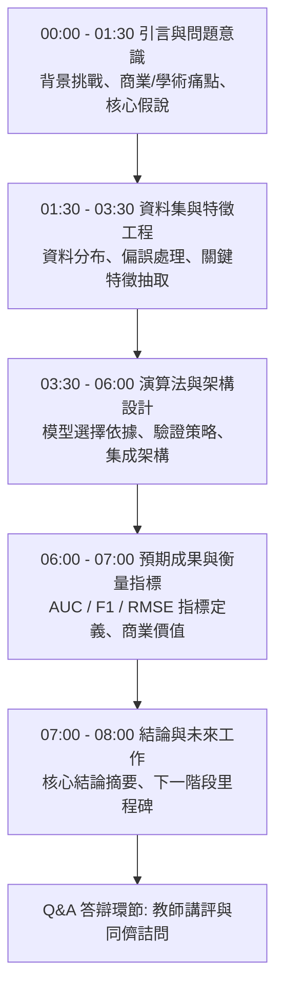

# 🎙️ AI-OPT-04-PROPOSAL-PRESENTATIONS 進階人工智慧與最佳化 Lesson 04：專案提案全英語發表演練、限時控時與同儕評核

> **課程主題**：專題提案全英語發表（EMI Proposal Rehearsal）、8分鐘時間控制、同儕互動與問題答辯  
> **日期**：2026-03-19  
> **授課教授**：授課講師（AI 與機器學習領域講座教授）  
> **發表團隊**：資管所全體研一修課學員  
> **核心模組**：EMI Presentation, Time Management, Peer Review, Problem Formulation, Model Evaluation  
> **學習目標**：訓練學員於國際研討會情境下進行全英文學術簡報，掌握結論先行、精準控時與答辯應變技巧  
> **關聯文件**：[📄 完整雙語原話逐字稿 (20260319-專案提案全英語發表與評審問答.full.md)](./20260319-專案提案全英語發表與評審問答.full.md)

---

## Executive Summary

本篇為國立中央大學資訊管理研究所 114 學年度第二學期 EMI 全英語授課核心課程——**《進階人工智慧與最佳化》（Advanced AI & Optimization）**之雙軌課堂筆記。

本週進行學期專題提案（Project Proposal）全英文發表考核。授課教師嚴格設定每組 8 分鐘發表限制，強調「先發表或後發表並不影響分數，關鍵在於講者的颱風、時間掌握與訊息精煉度」。各組依序登台展示針對選定資料集之探索洞見、預計採用之機器學習演算法與驗證指標。教師針對各組簡報之視覺文字密度、模型泛化能力假設及評估指標合理性進行逐一點評，並引導全班進行高強度同儕詰問與技術交流。

---

## 🏛️ 8分鐘學術專題全英文發表結構與時間分配

---

## 🎯 核心重點整理 (Key Takeaways)

### 1. 嚴格遵守發表時間紀律（Time Discipline）
- 演講超時在國際學術研討會中是嚴重扣分項。學員必須經過反覆排練，將內容濃縮在 8 分鐘內，確保核心結論在時間結束前完整交付。

### 2. 以受眾為中心（Audience-Centric）的投影片設計
- 投影片是輔助溝通的工具，切忌密密麻麻放置大量代碼或文字。應以清晰架構圖、統計分布圖為核心，講者面向觀眾眼神接觸，而非背對觀眾念稿。
