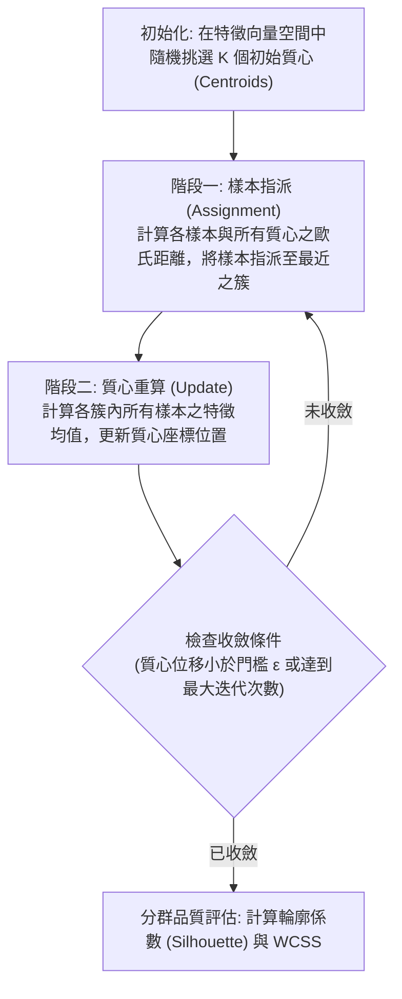

# 🎙️ AI-OPT-05-KMEANS-CLUSTERING 進階人工智慧與最佳化 Lesson 05：K-Means 非監督式分群演算法原理、向量空間與質心迭代收斂

> **課程主題**：非監督式學習（Unsupervised Learning）、K-Means 演算法數學原理、向量空間歐氏距離與質心迭代  
> **日期**：2026-03-26  
> **授課教授**：授課講師（AI 與機器學習領域講座教授）  
> **發表團隊**：資管所全體研一修課學員  
> **核心模組**：K-Means, Centroid Initialization, Euclidean Distance, WCSS, Elbow Method, Silhouette Score  
> **學習目標**：掌握 K-Means 演算法在無標籤資料探勘中的數學推導與實作步驟，學會選取最優群數 K 值並評估分群品質  
> **關聯文件**：[📄 完整雙語原話逐字稿 (20260326-KMeans分群演算法與向量空間.full.md)](./20260326-KMeans分群演算法與向量空間.full.md)

---

## Executive Summary

本篇為國立中央大學資訊管理研究所 114 學年度第二學期 EMI 全英語授課核心課程——**《進階人工智慧與最佳化》（Advanced AI & Optimization）**之雙軌課堂筆記。

本週深入講授非監督式學習經典演算法——K-Means 分群模型。授課教師以設定群數 K=5 為例，詳細推導演算法在多維向量空間中的運作流程：從隨機初始化 5 個質心（Centroids）出發，透過歐氏距離（Euclidean Distance）將所有資料點指派給最近之質心，再依各簇內樣本之幾何中心重新計算新質心位置。課程推導了簇內平方和（WCSS）的收斂過程，並指導學員如何運用肘部法則（Elbow Method）與輪廓係數（Silhouette Score）科學化決定最佳群數。

---

## 🏛️ K-Means 演算法迭代收斂與質心更新流程

---

## 🎯 核心重點整理 (Key Takeaways)

### 1. 敏感於初始質心選取與尺度縮放
- K-Means 演算法極易陷入局部最優解（Local Optima），且對特徵量綱極度敏感。實務中必須先進行特徵標準化（Standardization），並採用 K-Means++ 機率初始化策略以加快收斂。

### 2. 肘部法則（Elbow Method）的客觀判讀
- 透過繪製 WCSS 隨群數 K 增加之折線圖，尋找下降斜率劇烈變緩的轉折點（Elbow Point），搭配輪廓係數（Silhouette Score）檢驗簇內緊密度與簇間分離度。
