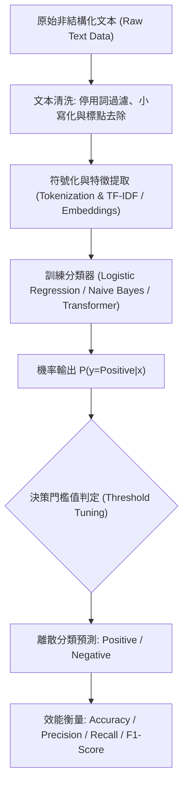

# 🎙️ AI-OPT-06-NLP-SENTIMENT-CLASSIFICATION 進階人工智慧與最佳化 Lesson 06：自然語言處理（NLP）文本情感分類基準與評估指標設計

> **課程主題**：自然語言處理（NLP）、文本分類（Text Categorization）、情感二元分類與評估指標分析  
> **日期**：2026-04-09  
> **授課教授**：授課講師（AI 與機器學習領域講座教授）  
> **發表團隊**：資管所全體研一修課學員  
> **核心模組**：NLP Pipeline, Tokenization, Text Categorization, Binary Classification, Accuracy, F1-Score  
> **學習目標**：掌握文本數據從前處理、特徵表示到情感分類器訓練之全流程，學會分析分類閾值對預測準確率之影響  
> **關聯文件**：[📄 完整雙語原話逐字稿 (20260409-自然語言處理與情感分類基準.full.md)](./20260409-自然語言處理與情感分類基準.full.md)

---

## Executive Summary

本篇為國立中央大學資訊管理研究所 114 學年度第二學期 EMI 全英語授課核心課程——**《進階人工智慧與最佳化》（Advanced AI & Optimization）**之雙軌課堂筆記。

本週正式進入自然語言處理（NLP）核心模組。授課教師引導學員探討如何將非結構化文本轉換為特徵向量，並進行正向（Positive）與負向（Negative）情感極性分類。課程特別指出真實世界文本分類的挑戰：『很多時候正向與負向類別並沒有絕對靜態的邊界定義』。教師引導學員透過準確率（Accuracy，預測正確樣本數/總樣本數）與混淆矩陣（Confusion Matrix）剖析分類邊界，並示範如何調整決策門檻值以因應類別不平衡問題。

---

## 🏛️ NLP 文本情感分類處理與評估管線

---

## 🎯 核心重點整理 (Key Takeaways)

### 1. 避免單純依賴單一 Accuracy 指標
- 在文本情感分類中，樣本常存在正負比例失衡。若負向樣本佔 90%，盲目猜測全為負向即可獲得 90% 準確率。必須搭配 Precision、Recall 與 F1-Score 全面檢視。

### 2. 動態分類邊界與業務語境適配
- 正面與負面的定義高度依賴業務情境（例如反諷、中性陳述）。模型設計應著重特徵詞上下文關聯，而非僅依賴孤立關鍵詞匹配。
