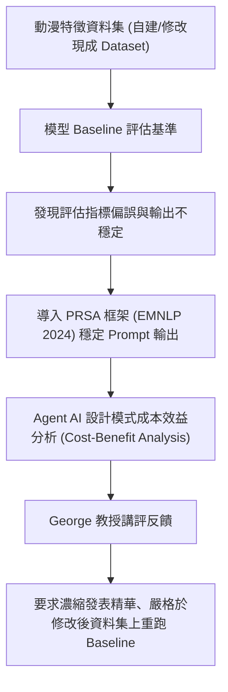

# 🛡️ 20260430-01 進階人工智慧與最佳化：學員專案發表（動漫人氣預測、評估指標偏誤緩解與Agent AI設計）

> **課程主題**：動漫人氣預測模型、評估指標偏誤緩解（Bias Mitigation）、Prompt 穩定性與 Agent AI 成本效益分析  
> **授課教授**：授課講師（George）  
> **發表團隊**：課堂專題研究團隊（Angie, Michelle, Benjamin Lee 等）  
> **核心模組**：Anime Popularity Modeling, Metric Bias Mitigation, PRSA Framework (EMNLP 2024), Agent AI Design Patterns  
> **關聯文件**：[📄 完整原話逐字稿 (20260430-動漫預測模型與偏誤緩解發表.full.md)](./20260430-動漫預測模型與偏誤緩解發表.full.md)

---

## 🏛️ 核心架構與概念流轉圖

---

## 🔑 重點提要 (Key Takeaways)

1. **評估指標偏誤之緩解**：針對動漫受眾主觀評分之偏差，透過調整預測特徵加權與基準校正，減輕極端值對模型的干擾。
2. **大語言模型輸出穩定性**：引入 EMNLP 2024 PRSA 框架，解決多變 Prompt 引發之 LLM 輸出漂移問題，提高實驗可重複性。
3. **課堂指導與講評**：George 提醒發表同學報告時應聚焦核心技術亮點、有效控制時間，並強調修改現成資料集後必須同步於修改集上重測 Baseline 方具說服力。
