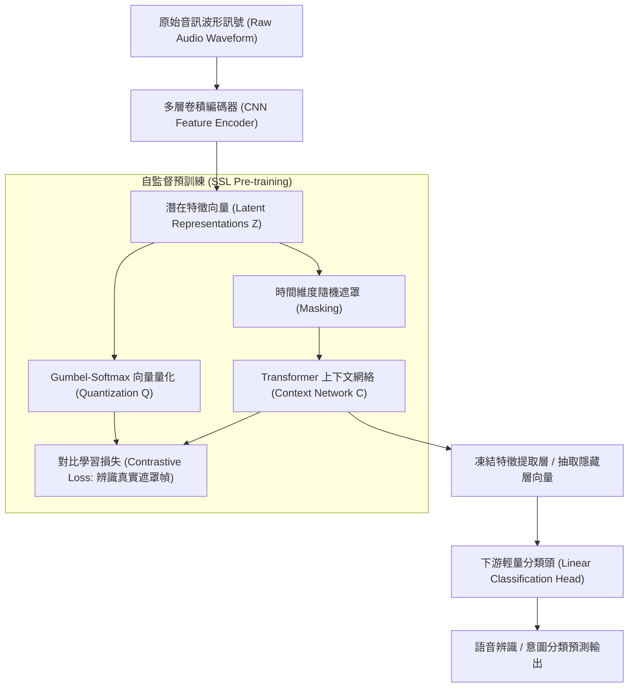

# 🎙️ AI-OPT-07-REPRESENTATION-LEARNING 進階人工智慧與最佳化 Lesson 07：Word2Vec 與 Wav2Vec 2.0 深度表徵學習與特徵提取架構

> **課程主題**：自監督學習（Self-Supervised Learning）、Word2Vec 詞嵌入、Wav2Vec 2.0 語音表徵學習與隱藏向量提取  
> **日期**：2026-05-21  
> **授課教授**：授課講師（AI 與機器學習領域講座教授）  
> **發表團隊**：資管所全體研一修課學員  
> **核心模組**：Self-Supervised Learning, Word2Vec, Wav2Vec 2.0, Latent Representations, Contrastive Loss, Downstream Fine-Tuning  
> **學習目標**：理解多模態深度表徵學習架構，掌握如何從大量未標註語音與文本中提取稠密特徵向量並微調下游任務  
> **關聯文件**：[📄 完整雙語原話逐字稿 (20260521-Word2Vec與Wav2Vec語音表徵學習.full.md)](./20260521-Word2Vec與Wav2Vec語音表徵學習.full.md)

---

## Executive Summary

本篇為國立中央大學資訊管理研究所 114 學年度第二學期 EMI 全英語授課核心課程——**《進階人工智慧與最佳化》（Advanced AI & Optimization）**之雙軌課堂筆記。

本週深入研討深度學習表徵學習（Representation Learning）最新進展。課程從經典文字嵌入 Word2Vec 的分散式表徵（Distributed Representation）切入，推進至語音領域當紅的自監督學習（SSL）模型——Wav2Vec 2.0。授課教師深入拆解模型內部結構：原始聲音訊號如何經過多層卷積特徵編碼器（Feature Encoder）轉換為高維隱藏特徵向量，並透過量化模組（Quantization）與對比學習損失函數（Contrastive Loss）進行無監督預訓練。課程最後引導學員如何抽取中繼層向量，並針對特定語音分類任務進行高效微調（Fine-Tuning）。

---

## 🏛️ Wav2Vec 2.0 語音表徵自監督學習與特徵提取架構

---

## 🎯 核心重點整理 (Key Takeaways)

### 1. 自監督學習大幅降低資料標註成本
- 傳統語音辨識高度依賴逐字音訊對齊標註。Wav2Vec 2.0 透過自監督遮罩預訓練，只需極少量標註音訊即可微調出達到 SOTA 表現之語音分類模型。

### 2. 隱藏層向量的跨任務遷移價值
- 預訓練模型的特徵提取層具備強大通用表徵力。實務上可直接提取 Context Network 之輸出向量作為固定特徵，快速串接下游分類器完成少樣本任務。
