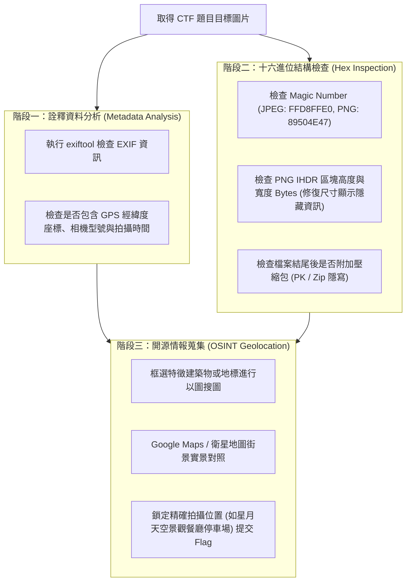

# 🛡️ SEC-CTF-01-STEGANOGRAPHY-OSINT 資安實戰 Lesson 01：CTF 圖片隱寫術分析、十六進位結構竄改與 OSINT 地理定位解題實務

> **課程主題**：CTF 搶旗賽資安實務、數位隱寫術（Steganography）、HEX 檔案結構分析、EXIF 詮釋資料與 OSINT 開源情報地理定位  
> **授課教授**：授課講師（資安戰隊指導教練）  
> **核心模組**：CTF Misc, Steganography, EXIF Metadata, Hex Editing, OSINT Geolocation, Google Lens  
> **學習目標**：掌握數位圖片隱寫偵測與還原技術（修改尺寸、附加封包），熟練運用開源情報（OSINT）比對地理座標解出競賽 Flag  
> **關聯文件**：[📄 完整原話逐字稿 (2026-04-08-01-圖片隱寫術分析與OSINT地理定位-proofread.md)](./2026-04-08-01-圖片隱寫術分析與OSINT地理定位-proofread.md)

---

## 🏛️ CTF Misc 圖片隱寫與開源情報分析工作流程

---

## 🎯 核心重點整理 (Key Takeaways)

### 1. 圖片檔案結構與隱寫術常見手法
- **EXIF 詮釋資料抽取**：相機或智慧型手機拍照時會自動將裝置型號、光圈快門與 GPS 經緯度直接嵌入圖片檔案標頭。隱寫題目中常隱藏 Flag 或提示訊息。
- **IHDR 尺寸位元組竄改 (PNG Chunk Tampering)**：
  - PNG 檔案在 `IHDR` Chunk 中定義了圖片寬度（4 Bytes）與高度（4 Bytes）。
  - 出題者常將高度修改為較小值，使圖片顯示時隱藏下方帶有 Flag 的區域。解題時透過十六進位編輯器（如 010 Editor、HxD）將高度 Bytes 還原或改大，即可重新顯示被遮蔽的內容。
- **檔案尾端夾帶 (File Carving / Append)**：在 JPEG 檔案結尾標記 `FF D9` 之後附加壓縮檔（`50 4B 03 04`），可使用 `binwalk` 或 `foremost` 自動抽離被隱藏之資料檔案。

### 2. OSINT (Open Source Intelligence) 地理定位實戰技術
- **圖像局部反搜**：當全圖搜尋無法精確比對時，使用裁切工具鎖定「非自然景觀之獨特人造建物、招牌或欄杆裝飾」，利用 Google Lens 等逆向圖庫比對出目標景點（案例：南投星月天空景觀餐廳）。
- **衛星地圖視角校正與精確定位**：比對照片拍攝視角、陰影方位與停車場地坪標線，判定拍攝者實際站立位置，以符合 CTF 題目對特定經緯度或地標名稱之檢驗要求。
