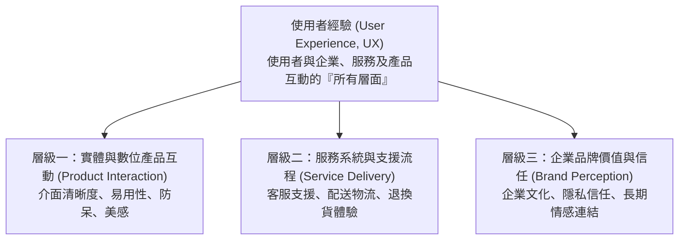
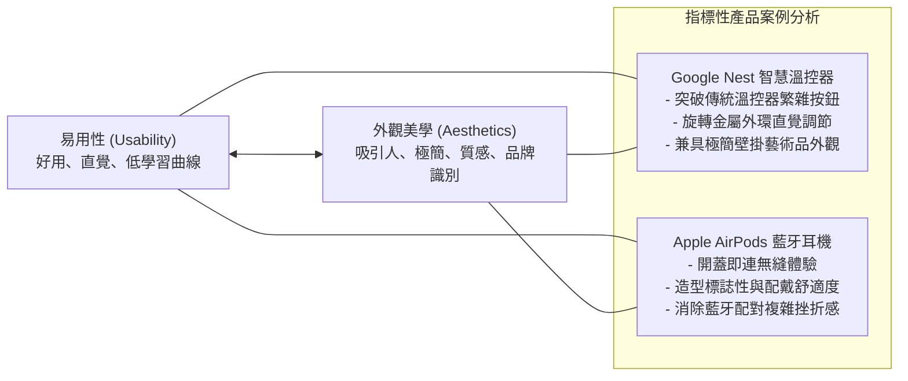

# 🛡️ HCI-02-UX-DEFINITION-USABILITY 人機互動與 UX 設計 Lesson 02：使用者經驗完整定義、智慧產品易用性與美學平衡

> **課程主題**：使用者經驗（User Experience, UX）、Nielsen Norman Group 權威定義、智慧硬體易用性（Usability）與工業美學平衡  
> **授課教授**：授課講師（人機互動與工業設計教授）  
> **核心模組**：NN/g UX Definition, Usability Heuristics, Industrial Design, Smart Home, Google Nest, Apple AirPods  
> **學習目標**：精熟 NN/g 對使用者經驗之全層面定義，理解使用者旅程中功能、易用性與審美價值的互補張力  
> **關聯文件**：[📄 完整原話逐字稿 (2026-03-03-02-使用者經驗定義與產品易用性-proofread.md)](./2026-03-03-02-使用者經驗定義與產品易用性-proofread.md)

---

## 🏛️ Nielsen Norman Group (NN/g) 使用者經驗全維度層級

---

## ⚖️ 智慧硬體設計張力：易用性 (Usability) vs. 工業美學 (Aesthetics)

---

## 🎯 核心重點整理 (Key Takeaways)

### 1. 使用者經驗 (User Experience, UX) 的標準定義
- **NN/g 權威詮釋**：使用者經驗「不僅僅是介面（UI）好不好看」，而是「終端使用者與公司、其服務以及其產品互動的所有層面（all aspects of the end-user's interaction with the company, its services, and its products）」。
- **整體旅程性**：包含購買前期待、拆箱體驗、初次設定挫折、日常使用流暢度乃至售後服務的全生命週期感受。

### 2. 易用性（Usability）與美學設計的相輔相成
- **美即好用效應（Aesthetic-Usability Effect）**：使用者傾向認為美觀的產品更容易使用，並對偶發的小瑕疵展現更高的容忍度。
- **直覺回饋與極簡架構**：以 Nest 智慧溫控器為例，傳統溫控器充斥晦澀的液晶按鈕與設定選單，Nest 透過精準旋轉外環與隨環境色變化的圓形螢幕，將複雜的物聯網溫控簡化為最原始直觀的物理操作。
