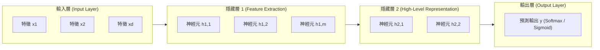
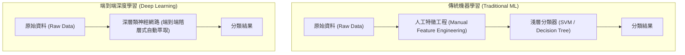

# 🛡️ ML-03-DEEP-LEARNING-MLP 機器學習實務 Lesson 03：深度學習導論、多層感知機 MLP 與神經網路架構設計

> **課程主題**：深度學習（Deep Learning）、多層感知機（MLP）、人工神經網路拓撲結構與 GPU 平行運算  
> **授課教授**：授課講師（資訊工程授課教授）  
> **核心模組**：Deep Learning, Artificial Neural Networks, MLP, Hidden Layers, GPU Parallel Computing, Medical AI  
> **學習目標**：理解人工類神經網路如何模擬生物電位訊號傳導，掌握輸入層、隱藏層與輸出層之架構設計與算力需求  
> **關聯文件**：[📄 完整原話逐字稿 (2026-03-09-03-深度學習與多層感知機-proofread.md)](./2026-03-09-03-深度學習與多層感知機-proofread.md)

---

## 🏛️ 多層感知機 (Multi-Layer Perceptron, MLP) 拓撲架構

---

## ⚡ 傳統機器學習 vs. 深度學習之特徵工程演進

---

## 🎯 核心重點整理 (Key Takeaways)

### 1. 生物神經元至人工神經元之數學抽象
- **突觸權重與偏壓**：神經元接收前一層訊號 $x_i$，與權重 $w_i$ 相乘並加上偏壓 $b$：
  $$z = \sum_{i=1}^{d} w_i x_i + b = \mathbf{w}^T \mathbf{x} + b$$
- **激勵函數（Activation Function）**：引入非線性變換 $\sigma(z)$（如 ReLU、Sigmoid、Tanh），打破線性組合之侷限，賦予網路逼近任意複雜非線性函數的能力（萬能逼近定理 Universal Approximation Theorem）。

### 2. 隱藏層（Hidden Layers）層數與節點數設計原則
- **特徵抽象階層化**：淺層神經元負責捕捉低階局部特徵（如影像邊緣、訊號頻率脈衝）；深層神經元組合低階特徵以形成高階語義概念。
- **超參數經驗法則**：層數過少可能導致欠擬合（Underfitting）；層數過深且節點過多則易引發過擬合（Overfitting）與梯度消失（Vanishing Gradient），需仰賴經驗法則配合交叉驗證決定。

### 3. GPU 平行加速對於深度學習之關鍵推動
- **矩陣乘法並行性**：類神經網路前向傳遞與反向傳播本質上為高維矩陣乘法運算，GPU 具備成千上萬個核心，可提供極高吞吐量的平行運算能力，將數十小時的訓練時間縮短至數十分鐘。
