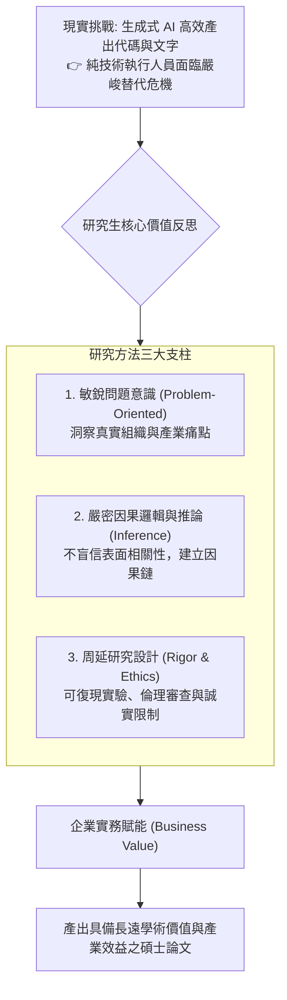

# 🎙️ RES-METH-00-ORIENTATION 資訊管理研究方法論 Week 01：課程導論、研究動機與 AI 時代下的學者競爭力

> **課程主題**：碩士班研究方法導論、研究動機與問題意識、生成式 AI 衝擊與管理學院實務價值  
> **日期**：2026-02-25  
> **授課教授**：授課講師（資管系資深講座教授、教育部學術獎得主）  
> **對談學員**：資管所碩一全體研究生、大四直升預研生  
> **核心領域**：研究方法論（Research Methodology）、問題導向研究（Problem-Oriented）、生成式 AI 替代性、管理學院應用價值、研究倫理  
> **學習目標**：理解研究生撰寫論文之本質與學術思維訓練，掌握在 AI 時代如何聚焦具備企業實務價值與理論深度的研究題目  
> **關聯文件**：[📄 完整原話逐字稿 (20260225-研究方法-01-課程導論與研究動機.full.md)](./20260225-研究方法-01-課程導論與研究動機.full.md)

---

## Executive Summary

本篇為國立中央大學資訊管理研究所 114 學年度第二學期碩士班核心必修課程——**《研究方法論》（Research Methodology）**開學第一堂導論課之完整雙軌紀錄。

授課教授開宗明義拋出靈魂提問：**「研究生為什麼要念研究所？為什麼要做研究、寫論文？」**。教授犀利指出，現代社會「越純技術、越單一專業的技能，越容易被 AI 迅速取代」；大型科技企業已大幅縮減純初階工程師需求。管理學院資訊管理研究生的核心立足點在於**「問題導向（Problem-Oriented）」**——理解真實企業組織如何運作，並運用資訊科技、數據模型與系統架構去解決實際瓶頸。本堂課詳細梳理了學術嚴謹度、可復現性、研究倫理委員會審查，以及論文寫作必須「清晰、直接了當（Straightforward）」之基本要求。

---

## 🏛️ 研究思維與 AI 時代競爭力定位

---

## 🎯 核心重點整理 (Key Takeaways)

### 1. 為什麼要念碩士與做研究？
- **從被動解題走向主動命題**：大學部多為吸收已知知識與照表操課，研究所的精髓在於「學會探索未知的科學方法」。撰寫論文是訓練研究生獨立邏輯推演與批判性思考的最佳沙盤推演。
- **管理學院的本質是「應用」**：我們不做無人問津的象牙塔空談，所有資訊管理研究最終必須落地於協助企業提升營運效能與決策品質。

### 2. 生成式 AI 時代的「專家危機」
- **單一專業最易淘汰**：當前 AI 寫程式不會累且產出飛快。只會撰寫基礎代碼的初階人力正被大量取代，唯有具備跨領域整合、商業洞察與嚴謹因果論證能力的研究者才能立於不敗之地。

### 3. 論文寫作的黃金法則：直接了當 (Straightforward)
- **拒絕晦澀堆砌**：好的學術寫作應當乾淨、精準、毫不拖泥帶水。所有推論必須透明交代實驗過程以確保可復現性（Replicability），誠實揭露研究限制而非隱瞞瑕疵。
