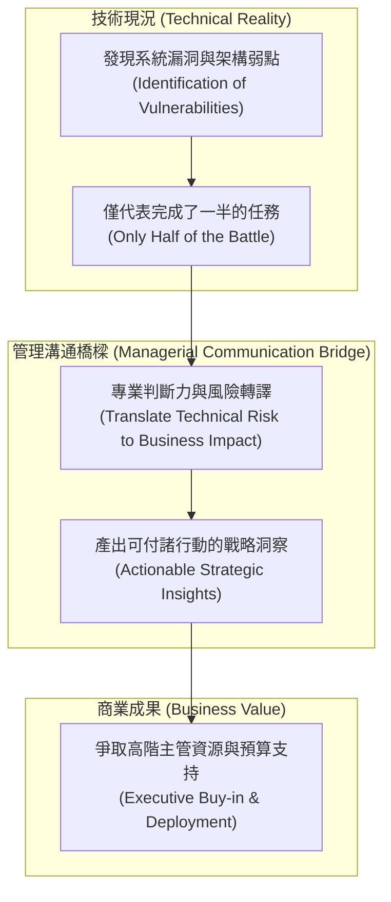

# 🎙️ MC-02-PROFESSIONAL-POSITIONING 管理溝通 Week 02：專業定位與學員英語自介發表（含 Youchen 資安風險轉化商務影響力發表）

> **課程主題**：專業定位（Professional Positioning）、溝通信譽建立與全班全英語專業自我介紹發表  
> **日期**：2026-09-17  
> **授課教師 / 發表人**：授課講師、全班學員、Jerry Youchen Zhang (張右城)  
> **核心領域**：Managerial Communication, EMI, Professional Positioning, Audience Analysis, Business Impact  
> **學習目標**：掌握專業自我定位與個人品牌塑造方法，學習如何將深奧之技術專業轉化為具備商業說服力之演講內容  
> **關聯文件**：[📄 完整雙語原話逐字稿 (20260917-管理溝通-Week02-專業定位與學員英語自介發表.full.md)](./20260917-管理溝通-Week02-專業定位與學員英語自介發表.full.md)

---

## Executive Summary

本篇為國立中央大學資訊管理研究所 115 學年度碩二上學期 EMI（English as a Medium of Instruction）全英語授課核心課程——**《管理溝通與專業表達》（Managerial Communication）**第 2 週之雙軌完整紀錄。

課程由具備行為科學與資訊管理跨領域研究背景之專任教師 Fatiha 全英語講授。本週深入探討了專業定位（Professional Positioning）、溝通信譽建立與全班全英語專業自我介紹發表。課堂強調跨國科技企業環境中，技術人員不可將溝通視為單純的文字轉換，而應視為「行動中的專業判斷力（Professional Judgment in Action）」。本篇筆記完整收錄了授課教師的原話講義解說、課堂問答、作業指引，以及學員實機發表與互動反饋。

---

## 🏛️ Youchen 專業溝通定位：技術風險轉化為商務決策

---

## 🎯 核心重點整理 (Key Takeaways)

### 1. Youchen 本人專題演講核心洞見
- 「在網路安全中，找出系統漏洞只是一半的戰鬥；真正的挑戰在於如何將這些發現轉化為利害關係人能夠付諸實踐的戰略洞察。」管理溝通不只是語言能力，更是在行動中的專業判斷力。

### 2. 專業信譽的三大維度
- 建立專業形象仰賴技術實力展現（開發 Windows 工具與 CTF 競賽實踐）、跨領域溝通適配度，以及身心平衡與沉澱（登山戶外活動）。
