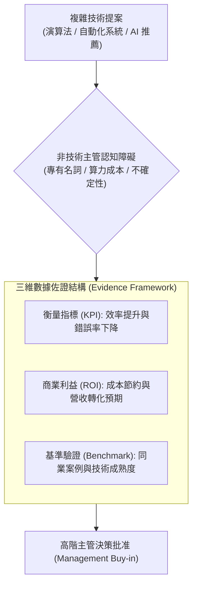

# 🎙️ MC-03-TECH-BUSINESS-COMMUNICATION 管理溝通 Week 03：資訊科技、人工智慧與商務決策溝通架構

> **課程主題**：科技與商務溝通、數據證據鏈建立、AI 與推薦演算法價值量化  
> **日期**：2026-09-24  
> **授課教師 / 發表人**：授課講師、學員  
> **核心領域**：Managerial Communication, EMI, Professional Positioning, Audience Analysis, Business Impact  
> **學習目標**：學習向非技術高階主管進行科技提案的框架，運用結構化數據消除認知落差，建立專案可信度  
> **關聯文件**：[📄 完整雙語原話逐字稿 (20260924-管理溝通-Week03-科技與商務決策溝通.full.md)](./20260924-管理溝通-Week03-科技與商務決策溝通.full.md)

---

## Executive Summary

本篇為國立中央大學資訊管理研究所 115 學年度碩二上學期 EMI（English as a Medium of Instruction）全英語授課核心課程——**《管理溝通與專業表達》（Managerial Communication）**第 3 週之雙軌完整紀錄。

課程由具備行為科學與資訊管理跨領域研究背景之專任教師 Fatiha 全英語講授。本週深入探討了科技與商務溝通、數據證據鏈建立、AI 與推薦演算法價值量化。課堂強調跨國科技企業環境中，技術人員不可將溝通視為單純的文字轉換，而應視為「行動中的專業判斷力（Professional Judgment in Action）」。本篇筆記完整收錄了授課教師的原話講義解說、課堂問答、作業指引，以及學員實機發表與互動反饋。

---

## 🏛️ 科技提案至商務決策轉譯管線

---

## 🎯 核心重點整理 (Key Takeaways)

### 1. 消除技術行話（Jargon）的負面影響
- 面對非技術決策者時，過多底層架構名詞只會帶來認知負擔。溝通重點應放在「解決了什麼業務瓶頸」與「帶來何種商業價值回報」。

### 2. Assignment 2 實戰要領
- 作業要求學員選擇真實科技情境，依據目標受眾設計三段式商務論點，並以 PDF 格式繳交完整架構與佐證數據。
