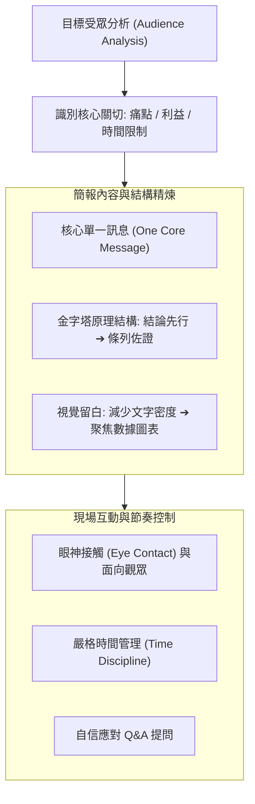

# 🎙️ MC-04-AUDIENCE-ANALYSIS-PRESENTATION 管理溝通 Week 04：受眾心理分析、結構化簡報設計與常見溝通陷阱防範

> **課程主題**：受眾心理學（Audience Analysis）、簡報視覺焦點引導與演講避坑指南  
> **日期**：2026-10-01  
> **授課教師 / 發表人**：授課講師、學員  
> **核心領域**：Managerial Communication, EMI, Professional Positioning, Audience Analysis, Business Impact  
> **學習目標**：掌握受眾地圖（Audience Mapping）繪製技巧，學會精簡投影片文字量、掌控時間節奏並避免認知過載  
> **關聯文件**：[📄 完整雙語原話逐字稿 (20261001-管理溝通-Week04-受眾分析與簡報結構設計.full.md)](./20261001-管理溝通-Week04-受眾分析與簡報結構設計.full.md)

---

## Executive Summary

本篇為國立中央大學資訊管理研究所 115 學年度碩二上學期 EMI（English as a Medium of Instruction）全英語授課核心課程——**《管理溝通與專業表達》（Managerial Communication）**第 4 週之雙軌完整紀錄。

課程由具備行為科學與資訊管理跨領域研究背景之專任教師 Fatiha 全英語講授。本週深入探討了受眾心理學（Audience Analysis）、簡報視覺焦點引導與演講避坑指南。課堂強調跨國科技企業環境中，技術人員不可將溝通視為單純的文字轉換，而應視為「行動中的專業判斷力（Professional Judgment in Action）」。本篇筆記完整收錄了授課教師的原話講義解說、課堂問答、作業指引，以及學員實機發表與互動反饋。

---

## 🏛️ 以受眾為中心之簡報設計架構

---

## 🎯 核心重點整理 (Key Takeaways)

### 1. 受眾分析為簡報之本
- 簡報成功的關鍵不在於講者想說什麼，而在於受眾能帶走什麼。將技術細節精簡為受眾切身相關的關鍵結論。

### 2. 避開常見發表地雷
- 避免背對觀眾念投影片、投影片文字密密麻麻造成認知過載、超時擠壓互動時間；建議善用視覺重點與自信站姿引導聽眾注意力。
