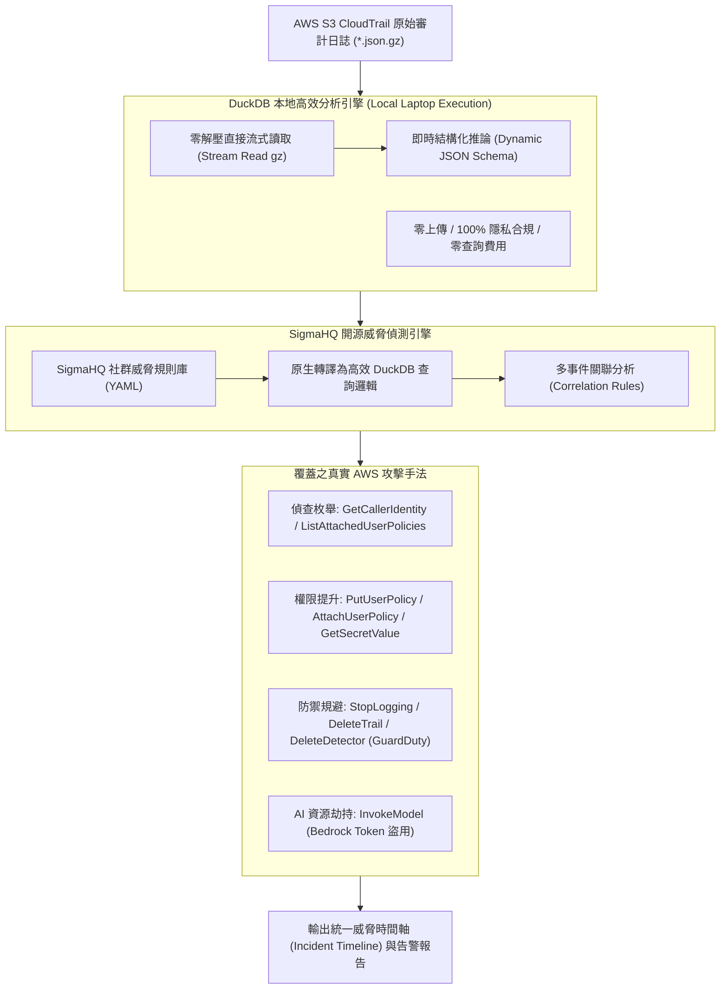

# 🎙️ SEC-AWS-CLOUDTRAIL-DUCKDB-SIGMA AWS CloudTrail 偵測工程：基於 DuckDB 與 SigmaHQ 的本地日誌威脅狩獵

> **會議主題**：AWS CloudTrail 偵測工程：基於 DuckDB 與 SigmaHQ 的本地日誌威脅狩獵  
> **日期**：2026-09-12  
> **主講人**：講者、大會司儀  
> **核心領域**：AWS CloudTrail、偵測工程（Detection Engineering）、DuckDB 本地查詢、SigmaHQ 規則引擎、威脅狩獵、LLM Jacking  
> **學習目標**：掌握免上傳雲端之本地高效日誌分析架構，運用 SigmaHQ 開源偵測規則快速捕獲真實雲端攻防鏈與 AI 資源濫用  
> **關聯文件**：[📄 完整雙語原話逐字稿 (20260912-AWS-CloudTrail偵測工程與DuckDB-SigmaHQ本地威脅狩獵.full.md)](./20260912-AWS-CloudTrail偵測工程與DuckDB-SigmaHQ本地威脅狩獵.full.md)

---

## Executive Summary

本場雲端安全專題演講深入探討了企業在面臨 **AWS CloudTrail** 海量審計日誌調查時的真實痛點與突破性技術架構。

傳統調查模式要麼依賴 **AWS Athena**（每 TB 掃描產生高昂費用、需自建 Schema 與分割區），要麼仰賴應變人員在凌晨三點手動透過 `jq`、`grep` 解壓查詢，效率極其低下。講者團隊設計了一套基於 **DuckDB** 嵌入式分析引擎與 **SigmaHQ** 偵測規則標準的本地威脅狩獵工作流程。該工具具備「**零代理（No Agent）、免建叢集（No Cluster）、零授權費（No License）、日誌不出本地磁碟（Data Never Leaves Disk）**」之極致隱私與成本優勢，並能原生解析與匹配 SigmaHQ 社群偵測規則。演講深度示範了針對 AWS 實戰攻擊鏈（包含 IAM 偵查枚舉、提權、關閉 GuardDuty/CloudTrail 防禦規避，以及新興針對 Amazon Bedrock `InvokeModel` 的大語言模型資源劫持 LLM Jacking）之快速關聯分析與誤報抑制方法。

---

## 🏛️ 核心架構與威脅偵測管線

---

## 🎯 核心重點整理 (Key Takeaways)

### 1. 傳統 CloudTrail 調查的兩難與突圍
- **Athena 與 SIEM 的成本陷阱**：探索性查詢（Exploratory Queries）每掃描 1 TB 資料即產生費用，甚至可能因查詢錯誤一無所獲而浪費預算；大型 SIEM 建置期過長且往往受限於日誌吞吐量上限。
- **DuckDB 嵌入式查詢革新**：直接在資安分析師的筆記型電腦本機執行，直接讀取磁碟上的 `.json.gz` 壓縮檔，無需預先解壓縮數百 GB 的資料，查詢秒級響應且完全零雲端成本。

### 2. SigmaHQ 規則生態與本地落地
- **社群知識結晶（Community Knowledge）**：不需自行從頭撰寫複雜的 AWS 威脅邏輯，直接站在 SigmaHQ 全球防禦社群的肩膀上。
- **支援關聯規則（Correlation Rules）**：超越單一 API 呼叫判斷，透過時間窗口判定多步驟攻擊組合（例如：短時間內 `GetCallerIdentity` 緊接著 `AttachUserPolicy` 與 `StopLogging`）。

### 3. 新興威脅：大模型算力劫持 (LLM Jacking)
- **Bedrock API 濫用偵測**：攻擊者取得 IAM 存取金鑰後，不再僅是挖礦，而是大量呼叫 `InvokeModel` 消耗受害企業的大模型 Token 額度進行免費用量轉售，本架構已將該 API 納入重點即時審計指標。
