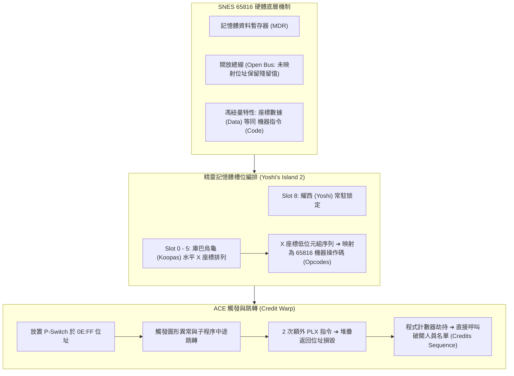

# 🕹️ REV-SNES-MARIO-ACE-EXPLOIT 超級瑪利歐世界（SNES）任意代碼執行（ACE）硬體機制與精靈記憶體漏洞逆向解析

> **會議主題**：超級瑪利歐世界（SNES）任意代碼執行（ACE）硬體機制與精靈記憶體漏洞逆向解析  
> **日期**：2026-09-12  
> **主講人**：講者  
> **核心領域**：SNES 65816 組合語言、任意代碼執行（ACE）、記憶體資料暫存器（MDR）、開放總線（Open Bus）、Sprite 記憶體槽位排列、Credit Warp  
> **學習目標**：深入理解超任主機底層硬體暫存器特性、馮紐曼架構資料即程式碼之漏洞成因，以及遊戲極速通關中經典記憶體操控手法  
> **關聯文件**：[📄 完整雙語原話逐字稿 (20260912-超級瑪利歐世界-SNES任意代碼執行ACE記憶體漏洞逆向解析.full.md)](./20260912-超級瑪利歐世界-SNES任意代碼執行ACE記憶體漏洞逆向解析.full.md)

---

## Executive Summary

本場逆向工程專題分享深度拆解了遊戲極速通關（Speedrun）歷史上最經典的漏洞利用技術——**超級瑪利歐世界（Super Mario World, SNES）任意代碼執行（Arbitrary Code Execution, ACE）**。

演講從任天堂 16 位元主機（SNES / Super Famicom）的 **Ricoh 5A22 (65816)** 硬體特性切入，揭示了**記憶體資料暫存器（Memory Data Register, MDR）**與**開放總線（Open Bus）**之物理特性：當 CPU 嘗試存取未映射之記憶體位址時，匯流排將保留上一筆讀寫資料而不更新，造成程式跳轉至未預期位置。演講展示了攻擊者如何將遊戲中的**精靈（Sprite）記憶體槽位**（Slot 0–9 放置庫巴烏龜、Slot 8 固定鎖定耀西）之 X 座標低位元組，精準排布為合法的 65816 機器指令序列；最後利用 P-Switch 於特定記憶體位址（`0E:FF`）觸發跳轉，藉由堆疊錯誤（2 次多餘的 `PLX` 指令使返回位址丟失），成功將程式計數器（PC）引導至偽造的程式碼區段，觸發瞬時通關字幕（Credit Warp）。

---

## 🏛️ 漏洞利用與記憶體注入流程圖

---

## 🎯 核心重點整理 (Key Takeaways)

### 1. 資料與程式碼的界線模糊 (Von Neumann Architecture)
- 在電腦架構中，記憶體內的位元組序列既是數據，也是指令。只要程式計數器（PC）被引導至該處，任何遊戲座標、計數器都能化為可執行代碼。

### 2. 精靈槽位的高位優先（High-Slot First）生成邏輯
- 遊戲生成精靈時會優先搜尋編號最高的可用槽位（Slot 11 留給莓果特殊物件、Slot 9 給常規物件）。利用踢殼讓耀西固定進入 Slot 8，便能精確預測後續烏龜進入 Slot 0–5 的記憶體偏移量。

### 3. Open Bus 與堆疊破壞的精妙結合
- 漏洞利用巧妙利用了跳入迴圈中段導致的堆疊不平衡（Stack Misalignment），在常規子程序返回前消除了原本的調用歷史，直接將執行權轉移至由烏龜座標拼成的 Payload，達成零硬體改裝的遊戲控制權劫持。
