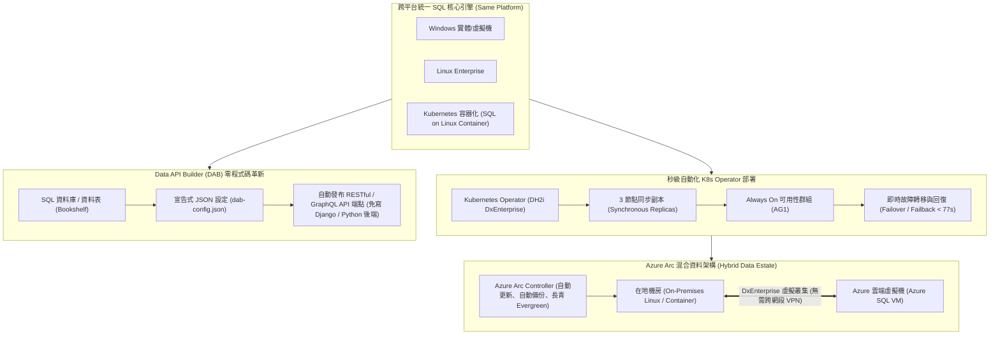

# 🚀 DEV-06-SQL-CONTAINERS-AZURE-ARC-DAB 現代化資料平台：SQL Server 容器化、Kubernetes 高可用部署、Azure Arc 混合雲與 Data API Builder

> **演講主題**：Microsoft DevDays Asia 2026 核心技術論壇：SQL Server 容器化生態、K8s Operator 快速部署、Azure Arc 混合雲與 Data API Builder (DAB)  
> **演講講者**：Amit Khandelwal (Microsoft Principal Product Manager), Davidus / Tejas (Microsoft PM)  
> **核心模組**：SQL Server Containers, Kubernetes Operator, Always On Availability Groups, Azure Arc, Data API Builder (DAB)  
> **學習目標**：精熟現代化容器資料庫高可用性配置、跨雲地混合架構容錯移轉機制與宣告式 REST/GraphQL API 自動化發布  
> **關聯文件**：[📄 完整原話逐字稿 (20260922-SQL容器化與Azure-Arc混合資料平台.full.md)](./20260922-SQL容器化與Azure-Arc混合資料平台.full.md)

---

## 🏛️ 現代化 SQL 容器、Azure Arc 混合雲與 DAB 架構圖

---

## 🎯 核心重點整理 (Key Takeaways)

### 1. SQL Server 容器化思維轉變
- **打破傳統部署迷思**：SQL Server 引擎核心在 Windows、Linux 與 Docker 容器完全同源同質；容器化為資料庫帶來輕量、秒級啟動與不可變基礎架構（Immutable Infrastructure）優勢。
- **Kubernetes Operator 極致自動化**：結合 DH2i DxEnterprise Operator，僅需一條宣告式指令即可在 77 秒內於 K8s 叢集完整部署具備 Active Directory 認證的三節點同步複本 Always On 可用性群組。

### 2. 混合雲資料資產（Hybrid Data Estate）跨界拓撲
- **無縫跨網段容錯移轉**：運用智慧虛擬叢集技術，本機筆電、地端資料中心與公有雲 Azure VM 三者可組成跨異質環境可用性群組，**無需複雜之站對站 VPN 網路設定**，按鍵即時完成跨界主節點移轉。
- **Azure Arc 賦能 Evergreen 資料服務**：透過在地端部署 Azure SQL Managed Instance 容器並受 Azure Arc 控制器託管，使地端資料庫享有雲端原生 PaaS 級的自動修補、備份與監控體驗。

### 3. Data API Builder (DAB)：開發者後端革命
- **零程式碼資料端點發布**：傳統開發者需透過 Django/FastAPI 手動撰寫模型、序列化器與路由；DAB 僅需提供一份宣告式 JSON 設定檔，即可自動將 SQL 資料表暴露為生產級安全的 RESTful 或 GraphQL API。
- **極致提升開發者生產力**：五分鐘內完成資料庫建立、實體註冊（`dab add`）與 API 服務啟動（`dab start`），大幅加速前後端分離架構之迭代週期。
