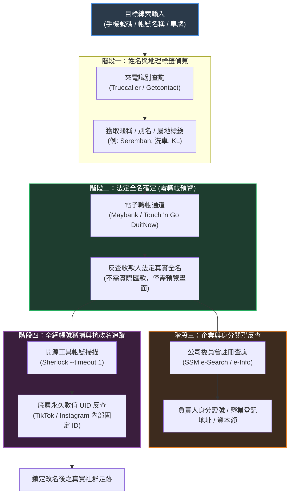
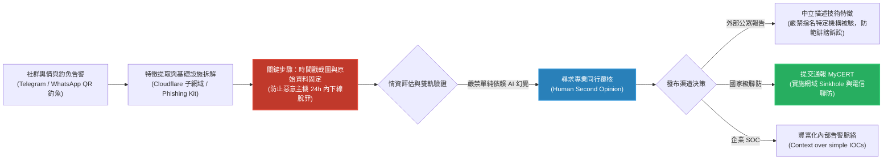

# 🎙️ Introduction to OSINT & Cyber Threat Intelligence (CTI) 技術精華筆記

> **會議主題**：Introduction to OSINT & Cyber Threat Intelligence (CTI) Sharing Session  
> **日期**：2026-09-27  
> **主講人**：
> - **Tunku Irfan**（OSINT 研究員、資安社群講師）
> - **foxy**（前威脅情資實習研究員、現役 CTI 分析師）  
> **核心領域**：開源網路情報（OSINT）、被動偵蒐（Passive Reconnaissance）、威脅情資分析（CTI）、釣魚基礎設施拆解、發布倫理與法律抗辯、MyCERT 協調通報  
> **關聯文件**：[📄 完整雙語原話逐字稿 (20260927-OSINT與網路威脅情報分享.full.md)](./20260927-OSINT與網路威脅情報分享.full.md)

---

## Executive Summary

本場資安線上技術研討會深入剖析了**開源網路情報（OSINT）**的實戰偵蒐手法，以及**威脅情資（Cyber Threat Intelligence, CTI）**在防禦一線的真實日常運作。

會議由 **Tunku Irfan** 率先示範如何透過公開管道進行被動身分串聯與漏洞定位，揭示了馬來西亞公共與教育體系長期存在的敏感資料暴露隱憂；下半場由 **foxy** 結合其在 CTI 團隊之實務經歷，深度拆解東南亞針對電子錢包之 QR Code 釣魚基礎設施與帳號劫持鏈（Account Takeover），並嚴正告誡研究員**「誠信遠勝於搶快（Integrity Over Speed）」**，公開發布威脅報告必須嚴格防範**名譽毀損（Defamation）**法律訴訟，並善用國家級應變中心（**MyCERT**）通報管道。會議尾聲收錄了兩位講者針對資安職涯、CTF 價值與社群即時聊天室之深度技術問答。

---

## 🏛️ 核心技術架構與分析流程圖

### 1. OSINT 被動偵蒐與身分反查流轉鏈 (Identity Pivot Chain)

---

### 2. CTI 威脅情資調查、證據保全與責任揭露生命週期

---

## 🔍 詳細技術段落剖析

### 一、 OSINT 被動偵蒐核心技術與合規防禦界線

#### 1. Doxxing（起底肉搜）與 OSINT（合法情資）的法律界線
* **違法 Doxxing**：因社群爭執或私人恩怨，非授權挖掘他人住家地址、親屬名冊或機敏身分證號並在公開平台散布曝光。此行為在馬來西亞及各國法律中皆構成刑事犯罪（侵犯個資與騷擾恐嚇）。
* **合法 OSINT**：僅在公開授權範疇（Public Domain）內，以被動方式收集威脅特徵、加固自身隱私或為資安防護提供威脅情報。

#### 2. 身分跳轉鏈（The Pivot Chain）實戰技巧
1. **來電標籤反查（Truecaller / Getcontact）**：利用群眾標籤獲取目標的社交暱稱、地域特徵（如 `Seremban`、`KL`）或從業背景（如 `Car Wash`）。
2. **零成本法定姓名反查（DuitNow 轉帳預覽）**：
   - 藉由行動銀行（Maybank / Touch 'n Go）發起手機 P2P 轉帳。
   - **關鍵點**：系統在最終點擊確認匯款前，必須向匯款人展示收款人的**法定註冊全名（Legal Registered Name）**。調查員無須完成交易，即可在預覽頁面取得 100% 官方驗證的真實全名。
   - *註：Maybank 在反覆查詢時不會打碼，穩定性高於 Touch 'n Go。*
3. **商業登記機構反查（SSM - Suruhanjaya Syarikat Malaysia）**：
   - 取得全名或商業登記號後，進入 SSM 官方入口（e-Search 或 e-Info）。
   - 可查閱該人員名下登記之獨資/合夥商號、公司登記地址、經營範圍與身分證末四碼。

#### 3. Google Dorking 高級語法矩陣
* `intext:"關鍵字"`：強制內文精確匹配，避免搜尋引擎拆詞。
* `intitle:"關鍵字"`：過濾 HTML `<title>` 包含關鍵字的頁面。
* `site:網域 / 國碼 TLD`：限定目標站台（如 `site:.my` 限定馬來西亞、`site:.il` 限定以色列、`site:tiktok.com` 限定特定平台）。
* `inurl:路徑`：限定特定 URL 路由特徵。
* `filetype:副檔名`：鎖定檔案類型（如 `filetype:pdf intext:sulit site:edu.my` 查找機密外洩文件；`filetype:png` 尋找透明圖示）。
* **布林排除運算子（`-`）**：在馬來西亞同名公眾人物（如 Tunku Irfan 鋼琴家）眾多的情境下，加上 `-intext:"Ismail"` 排除同名干擾，精確定位目標。
* **連網設備探勘**：`intitle:"webcam 7" inurl:8080`，可檢索出全球缺乏身分驗證、配置錯誤之 RTSP/VNC 監視器即時串流。

#### 4. Sherlock 跨平台枚舉與永久數值 UID 追蹤
* **Sherlock**：跨數百個主流社交平台（Discord, TikTok, Telegram, Threads, Spotify）自動化暴力枚舉使用者帳號名稱（`sherlock --timeout 1 <username>`）。
* **社群改名逃逸反制（Permanent User ID）**：
   - 社交平台帳號擁有三重屬性：**顯示名稱**（隨時更換）、**使用者帳號**（定期可改）、**底層 UID**（系統註冊分配之純數字，**終身不變**）。
   - 目標即使更換帳號名企圖抹除足跡，調查員只要調用先前保存的 UID（如 TikTok UID 工具），即可瞬間解析出改名後的最新帳號。

---

### 二、 CTI 實戰調查、開源情報維度與惡意基礎設施拆解

#### 1. 開源網路情報（OSINT）在威脅情資（CTI）中的四大核心職能（What You Use OSINT For）
* **👀 發現與偵蒐（See）**：即時捕獲公開社群誘餌（Public lures）、資料外洩站台聲明（Leak-site claims）、新註冊網域、仿冒品牌頁面、獨立研究員調查筆記與社群受害者討論。
* **🔗 關聯與串接（Connect）**：從一則 Threads 貼文串聯至整個主機叢集（Cluster of hosts）；從單一 QR Code 歸類至特定釣魚工具套件家族（Kit family）；將特定品牌濫用歸因至特定季節性攻擊波次。
* **🧪 豐富化情資（Enrich）**：當 SOC 監控發出內部告警時，調用開源情報補充該惡意網域、電話門號或社群誘餌主題背後之公開歷史脈絡與註冊足跡。
* **⚠️ 預警與決策推進（Warn）**：將本地觀察到的零散模式轉化為防詐欺部門（Fraud desk）、資安平台、企業員工或大眾學生能夠立即採取的防禦措施。

#### 2. OSINT 的適用時機與侷限邊界（Why & When）
* **為何首選 OSINT**：具備極高速度（Fast），只要鎖定公開範疇即完全合法（Legal if you stay public）；最重要的是，**在任何昂貴的跨國商業情資庫注意到馬來西亞或區域性攻擊前，本地社交工程攻擊早在社群平台上全面爆發**。
* **何時該放下 OSINT（何時不可踰越）**：當你準備登入仿冒釣魚後台、使用個人真實銀行/電子錢包 App 掃描釣魚 QR、或是企圖公開宣稱你無法提供確鑿證據的攻擊者名稱時，必須立刻停止。
* **何時是最佳工具**：社群平台上的新誘餌、工單中出現的可疑網域、節慶季節性詐騙模式；需要在數小時內取得即時脈絡，而非等待數週的官方機密專案。
* **何時遠遠不足**：精確實體歸因（Attribution）、封閉式 C2 基礎設施、真實受害企業衝擊分析、以及「這是否為針對本企業之專門定向 APT 攻擊」；這些必須仰賴內部端點日誌與付費專業遙測資料。

#### 3. 實戰案例剖析：Threads 假節慶「Kongsi Rezeki」QR 釣魚與帳號劫持（Account Takeover）
* **報告出處與調查全文**：講者 foxy 於 Notion 發布之開創性分析文章 [《Analysis of the "Kongsi Rezeki" on Threads social media QR phishing campaign》](https://app.notion.com/p/3ch0/Analysis-of-the-Kongsi-Rezeki-on-Threads-social-media-QR-phishing-campaign-314d05a447d5809abc48e44233792978)。
* **情境脈絡（Where & When）**：
  * **案發地點**：Threads 社群貼文，搭配偽造之 Touch 'n Go Money Packet / Maybank Scan & Pay QR Code。
  * **案發時間**：齋戒月至開齋節（Ramadan-Raya 2026），大眾彼此分享財富與祝福（Duit Raya / Kongsi Rezeki），公眾信任度極高、防備心極低。
* **社群真實誘餌話術（Lures）**：
  * *貼文一*：`Rezeki Ramadan Day 9 Swipe Left... Im the luckiest, Alhamdulillah... Hari ni kita kongsi rezeki lagi. Stay tune. Jom Kenal-Kenal`（附假 Touch 'n Go 電子錢包 Money Packet QR）。
  * *貼文二*：`Salam pagi, puasa ni sya nak bagi rezeki rm500.00 buat belanja bahan dapor tuk 185/orng shja untuk hari ni jee PM ML atau like yee`（承諾發放 RM 500 救濟金做廚房伙食費，附假 Scan & Pay 畫面）。
* **OSINT 溯源揭露之惡意基礎設施叢集（What OSINT Gave Me - IOCs）**：
  * **主網域**：母網域 `parent gbdjw[.]my`。
  * **子網域池**：大量連續編號主機 `numbered tngduitraya* hosts`（如 `tngduitraya01...`）。
  * **代理防護**：全數掛載於 Cloudflare CDN 隱匿真實來源 IP。
  * **品牌仿冒**：100% 複製政府救濟金與 Touch 'n Go 視覺品牌（Cloned aid branding）。
* **實質危害後果（The So-What）**：
  * 攻擊本質絕非單純「收集個資的首頁」，而是**手機門號 + OTP 驗證碼收割 $\to$ Telegram / WhatsApp Session Takeover（帳號全面劫持） $\to$ 深入受害者近期親友對話名冊（父母、手足）發動連鎖轉帳詐騙**。

#### 4. 基礎設施重複利用（Infrastructure Recycling）特徵
* 攻擊者受限於運營成本，不會為每個釣魚專案重新購買獨立伺服器與頂級網域。
* **典型架構**：在單一主網域（常掛載於 Cloudflare CDN 偽裝）下建立龐大的子網域池（Subdomain Pool）。
* **快速輪替**：單一釣魚子網域遭檢舉失效後，攻擊者秒級切換至另一子網域繼續發動攻擊。
* **惡意載荷偽裝**：雙副檔名混淆（`Wedding.apk`、`document.pdf.vbs`、`.apk.exe`），誘騙受害者點擊執行。

#### 5. 證據保全第一準則：第一時間截圖與原檔留存
* **惡意資產的朝生暮死特性**：釣魚伺服器與 C2 節點可能在 24 小時內即被雲端服務商封鎖或攻擊者自行銷毀。
* **調查鐵律**：發現活動當下必須立即進行**時間戳截圖（Timestamped Screenshots）**、抓取原始 HTML/JS 源碼、固定 DNS 歷程與 SSL 憑證資訊。
* **嚴肅警告**：如果沒有完整的截圖與證據鏈，隨後撰寫的任何調查報告都將失去可驗證性（Auditability）。

---

### 三、 CTI 研究員的專業誠信、法律風險、審核清單與責任通報

#### 1. CTI 的核心使命與決策推動（What CTI is For）
* **核心格言**：**「Change a decision before the next victim.」**（在下一個受害者出現前，改變防禦方的決策）。
* **Not This（非也）**：
  * ❌ 每天無腦傾倒 IP 清單（A daily dump of IPs）。
  * ❌ 空泛營造恐慌氣氛（A vibe that "APT is targeting us"）。
* **This（真正價值）**：
  * ✅ 依據受眾、具備即時時效的客觀證據（Evidence, timed to a consumer）：阻擋特定模式、向目標使用者預警、主動狩獵 TTP、評估實質業務風險。

#### 2. 五大行業別 CTI 價值需求矩陣（What Company A values can be noise to Company B）
在威脅情報中沒有「單一通用的 CTI 職位」，不同機構所需的情報維度截然不同：

| 機構類型 | 核心關注威脅情資（High Value） | 說明與典型場景 |
| :--- | :--- | :--- |
| **電子錢包 / 銀行 (E-wallet / Bank)** | 節慶 QR 釣魚工具包、針對客戶之 ATO 帳號劫持、人頭帳戶對話（Mule talk）、品牌商標仿冒濫用。 | 關注終端使用者資金安全與品牌信譽損害。 |
| **大學與教育機構 (University / Education)** | 學生入口網站仿冒鏡像（Student portal clones）、假獎學金誘餌、校園主題釣魚。 | 關注學生學籍個資、校園單一登入（SSO）憑證遭竊。 |
| **電信商與社群平台 (Telco / Platform)** | SIM-swap 偽冒話術、官方簡訊/推播通報管道遭濫用、組織化跨國詐騙集團。 | 關注網路通道濫用、非法簡訊廣播與批量人頭門號。 |
| **資安原廠與託管服務 (Vendor / MSSP)** | 可產品化、能跨客戶重複套用之攻擊者 TTPs 與基礎設施特徵叢集。 | 關注如何將情報轉化為通用偵測規則（YARA / Sigma）產品化賦能客戶。 |
| **國家級應變中心 (Government / CERT)** | 全國受害衝擊評估、公眾警訊宣導、跨網域 Sinkhole 與電信聯防下架路徑。 | 關注跨機構聯防、公共安全政策與跨國執法協調。 |

#### 3. CTI 分析師的一週實務日常（Insider View: What the week actually looks like）
> *「少一點好萊塢電影幻覺，多一點工單、寫作與『我們真的能確定嗎？』的嚴謹覆核。」（Less Hollywood. More tickets, writing, and "are we sure?"）*

* **早晨（Morning）**：處理排隊的問題佇列，而非漫無目的盲目狩獵。檢視昨夜發生了哪些詐騙？SOC 呈報了什麼告警？手頭證據是否足以支撐當前判斷？
* **中午（Midday）**：開源情報結合內部微小痕跡（Open sources + internal crumbs），進行特徵關聯聚集。排查昨日標記的惡意網域已死亡或已被攻擊者重建？
* **下午（Afternoon）**：撰寫人類能讀懂並採取行動的精簡報告（Slack 即時通知、一頁式摘要 One-pager、工單備註，絕非寫成冗長小說）。
* **不光彩的幕後（The Unglamorous Bit）**：花費更多時間說「此推論信心度低（low confidence）」與「需要第二人審核」，而不是在報告上輕率指控壞人是誰。
* **社群人脈（The Social Bit）**：與其他公司或社群朋友互通有無：「你看過這個釣魚套件嗎？」，社群互助即是高效率的情報收集。
* **面臨的風險與心理壓力（The Risk Bit）**：你在公開場合發布的每一句話，都可能被證實是錯的。承擔這份謹慎的壓力就是 CTI 工作的本質。

#### 4. 閱讀與評估 CTI 貼文的 6 大審核檢核表（Reading Checklist）
在相信任何社群或發布的 CTI 報告前，嚴格執行 6 步檢核：
1. **01 作者身分與信譽**：`Who wrote this, and can they be wrong in public?`（作者是誰？他敢在公開場合承認錯誤嗎？）
2. **02 第一手來源真偽**：`What is the primary source: post, domain, cert, screenshot with time?`（第一手來源是什麼？原始貼文、網域、SSL 憑證、還是帶時間戳的截圖？）
3. **03 時效性檢驗**：`Is the claim dated? Infra dies. Old IOCs are traps.`（情資是否過期？惡意基礎設施會死，過期 IOC 往往是誤導判斷的陷阱。）
4. **04 獨立多方交叉驗證**：`Did a second human / org see the same thing independently?`（有第二個獨立分析師或機構看到相同現象嗎？）
5. **05 事實與推測嚴格分離**：`Are facts separated from guesses? ("28 live hosts" vs "this is Group X.")`（客觀事實與主觀推論有無界線？「發現 28 台存活用戶」是客觀事實，「這是 X 國家級 APT」是主觀推測，兩者必須分開。）
6. **06 形容詞抽離法則**：`If I removed the adjectives, would any evidence remain?`（如果把所有誇張、渲染的形容詞抽掉，剩下的內容還包含實質證據嗎？）

#### 5. AI 輔助與洗白陷阱（AI Will Agree with You: Manners vs. Verification）
> *「AI 會順著你的話說。那不叫驗證，那只是 AI 的禮貌。」（AI will agree with you. That is not verification. That is manners.）*

* **真正有用（Useful）**：擬定報告大綱、清洗潤飾段落、提示你忘記詢問的問題維度。
* **毫無用處（Not useful）**：問 AI「我的推論聽起來合理嗎？」，AI 往往會回答「是的」，甚至捏造看似合理的偽腳註來支持你。
* **最致命的危害（Worse）**：把 AI 的肯定回答當作第二位資安分析師已經審核簽署；**實質上，你只是透過模型洗白了你個人的未經證實瞎猜（You laundered a guess through a model）**。
* **根本解方（The Fix）**：尋找能提出質疑的真人分析師（A human who can disagree）、CTI 領域的朋友、資深隊友；只有他們會直球提問：「封包在哪？原始貼文在哪？憑證在哪？」。

#### 6. 發布報告自律規範（Before You Publish & Public != Permitted）
* **名字永久烙印**：*「Your name stays on the page after the campaign dies.」*（惡意行動消亡後，你的名字仍會永遠留在那篇報告上）。
* **真實重於包裝**：*「A slightly incomplete true note beats a polished hallucination.」*（微小不完整但客觀真實的筆記，勝過精緻包裝的幻覺）。
* **誠信面對錯誤**：*「If you were wrong, say so on the same page. That is integrity, not embarrassment.」*（若證實判斷有誤，在原報告同頁面公開更正，這是專業誠信，而非難堪）。
* **公開不等於獲准（Public $\ne$ Permitted）行為守則**：
  * **DO（必須嚴格遵守）**：
    - 凡事先質疑（Question first）。
    - 時間戳記錄一切證據（Timestamp everything）。
    - 公開發布必須進行去害化轉義（Defang in public，如 `gbdjw[.]my`）。
    - 最小化他人個資曝光（Minimise other people's data）。
  * **DO NOT（嚴格禁止踰越）**：
    - 嚴禁擅自登入攻擊者釣魚後台套件（Enter the kit）。
    - 嚴禁使用個人真實銀行/錢包掃碼測試。
    - 嚴禁在暗網/黑市購買外洩資料庫。
    - 嚴禁為了蹭社群流量隨意肉搜公審帳號（Doxx a random account for clout）。

#### 7. 嚴防公眾名譽毀損（Public Defamation）訴訟
* 資安研究員常犯的致命錯誤：在社群上高調宣稱「某某銀行 100% 被攻陷了，證據在此」，而該機構並未官方證實。
* **法律風險**：即便技術面有發現異常，未經嚴密確認與官方核實的公開指控，將使研究員直接面臨**民事賠償與刑事誹謗起訴**。
* **報告原則**：保持客觀中立，僅陳述「發現某未受保護之伺服器包含特定特徵」，絕不過度引申或做出未經證實之斷言。

#### 8. 向國家級應變中心（MyCERT）負責任通報
* 私人研究員無法合法發動主動反擊（Hack Back）。
* 最有效的在地處置方式：將惡意基礎設施、釣魚工具包源碼與受害者特徵整理成結構化報告，提交給 **MyCERT (Malaysia Computer Emergency Response Team)**。
* 由 MyCERT 協調國家通訊委員會（MCMC）與電信業者實施全網 DNS Sinkhole 與惡意 IP 封鎖。

#### 9. 結尾反思提問（Key Reflection Questions）
* 「與其爭論『用什麼工具？』，更應該思考：這項情報改變了誰的決策？我們如何確信它是真的？」（*Better than 'what tool?' whose decision does this change, and how do we know it's true?*）
* 詰問實質價值（*Argue with the so-what.*）。
* 指明情資受眾（*Tell me who your consumer would be.*）。
* 反思最後一篇盲目相信的 CTI 文章（*Tell me the last CTI post you believed too fast.*）。

---

### 四、 資安與威脅情資職涯指南（AMA 關鍵問答）

| 提問方向 | 講者核心建議 (foxy & Tunku Irfan) |
| :--- | :--- |
| **技職 / 專科生能否進入資安？** | **完全可行**。第一線資安團隊看重的是基礎紮實度與實作熱情。建立個人部落格撰寫深度的技術剖析（Writeups）、架設 Home Lab 靶場、考取 AWS 雲端基礎證照，並在 LinkedIn 上主動有禮貌地與資安主管交流。 |
| **CTF 比賽經驗是否必備？** | CTF 能證明解決問題的逆向思維，對紅隊或滲透測試履歷極具加分效果；但自研實用專案（如基於 Volatility 開發記憶體鑑識工具、分析真實惡意樣本）更能展現獨立研究能力。 |
| **進入 CTI 前必須先做 SOC 嗎？** | 不一定。雖然 SOC 經驗能讓人熟悉真實告警量，但也有企業直接招收 CTI 實習生。鑑於初階 CTI 職缺較少，從 SOC 監控切入仍是穩健路徑。 |

---

### 五、 會議即時文字聊天室互動精華 (In-Meeting Live Chat)

會議進行期間，與會聽眾在即時聊天室中分享了諸多極具價值的實務經驗與在地安全情報：
1. **馬來西亞教育部 SAPS 歷史脆弱性（Ahmed 分享）**：
   - 早期學校考試分析系統（SAPS）存在重大認證缺陷，攻擊者只要隨機輸入馬來西亞身分證號（IC），即可在未受任何存取控制的情況下，直接調閱全國學生的所屬學校、就讀班級與歷年成績。
2. **車牌情資反查管道（Imran, Abdul Shukur, FARIS 探討）**：
   - 討論如何針對車牌進行 OSINT。陸路交通局（JPJ）與交警系統已逐步收緊查詢介面，但聽眾指出民間專門替銀行拖吊違約車輛的「拖車集團（Geng Tarik Kereta）」掌握了高度私有化的車牌追蹤資料庫與特殊管道。
3. **社群舊照背景以圖搜圖定位住址（piwww 分享）**：
   - 分享社群肉搜反查住址技巧：翻找目標多年以前與家人的生活舊照，擷取包含社區特徵、街景或獨特建築之背景，利用 Google Lens / Yandex 執行反向圖像搜尋（Reverse Image Search），極易精準鎖定目標之私人住宅社區。

---

## 🛡️ Actionable Takeaways & 個人與企業防護清單

### 1. 個人隱私加固指南 (Personal OPSEC)
- [ ] **脫鉤社群與法定身分**：社群平台嚴禁使用真實法定全名，頭像避免使用正面高解析度生活照。
- [ ] **防範 DuitNow 姓名洩漏**：檢視銀行與電子錢包設定，將轉帳顯示名稱自訂為化名（若銀行機制允許）或避免將常用私人手機綁定公開收款。
- [ ] **社群舊照背景清洗**：定期排查並刪除過往拍攝到門牌號碼、社區地標、車牌或登機證條碼之歷史照片。
- [ ] **警惕身分證號（IC）外流**：切勿在任何非必要之問卷、會員登記或社群活動中填寫真實身分證字號。

### 2. 企業與 CTI 團隊作業準則
- [ ] **嚴格落實證據鏈保全（Chain of Custody）**：發現惡意資產當下，立即採取時間戳截圖與原始封包/源碼存檔，防範伺服器迅速離線。
- [ ] **報告發布遵守免責與同行審核機制**：所有公開研究報告必須經由內部或資深同儕二審（Human Second Opinion），嚴禁在缺乏官方通報前對外斷言受害機構名稱。
- [ ] **主動對接國家級應變聯防**：高價值本地威脅情資優先提交 MyCERT，促成全網等級之快速封鎖與威脅下架。
