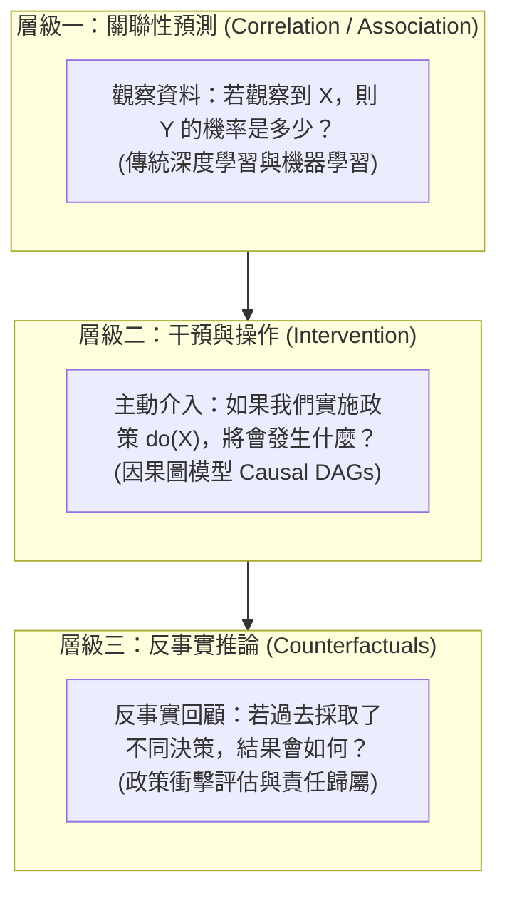

# 🛡️ KEYNOTE-UIC-XAI-CAUSAL-AI 國際頂尖學者講座：可解釋人工智慧 XAI、因果推論與反事實決策模型

> **講座主題**：可解釋人工智慧（Explainable AI, XAI）、黑盒子模型透明化、因果推論（Causal Inference）與反事實決策預測  
> **特聘主講**：Prof. Ali（University of Illinois Chicago 資訊與計算科學系主任、頂級期刊資深主編）  
> **核心模組**：Explainable AI, Interpretability, Causal Inference, Counterfactual Reasoning, Policy Impact  
> **學習目標**：理解現代深度學習黑盒子模型之解釋性瓶頸，掌握如何從純關聯性觀察邁向因果推論與反事實政策模擬  
> **關聯文件**：[📄 完整原話逐字稿 (國際專題講座-可解釋AI因果推論與反事實決策模型-proofread.md)](./國際專題講座-可解釋AI因果推論與反事實決策模型-proofread.md)

---

## 🏛️ 可解釋性 XAI 與因果推論階梯架構

---

## 🎯 核心重點整理 (Key Takeaways)

### 1. 現代 AI 系統的「黑盒子」解釋性危機
- **預測精準但缺乏洞察**：當前主流的深度神經網路在眾多基準任務上表現優異，但決策邏輯本質為不可解釋的高維非線性黑盒子，難以提供「為何產出此結果」的邏輯透明度。
- **高風險領域的信任門檻**：在醫療診斷、公共政策、司法審查與金融授信等關鍵場景中，缺乏解釋性的預測模型將面臨極高的合規與倫理風險。

### 2. 從單純觀察走向因果推論 (Causal Inference)
- **觀察性數據 vs. 政策介入**：機器學習模型擅長捕捉變數間的靜態關聯性（Passive Observation），但當組織頒布新政策或介入環境時，靜態關聯性往往失效。
- **反事實模擬（Counterfactual Prediction）**：因果模型具備推演「若採行新政策會發生什麼」之能力，為科學決策提供具備因果支撐的模擬預測工具。
