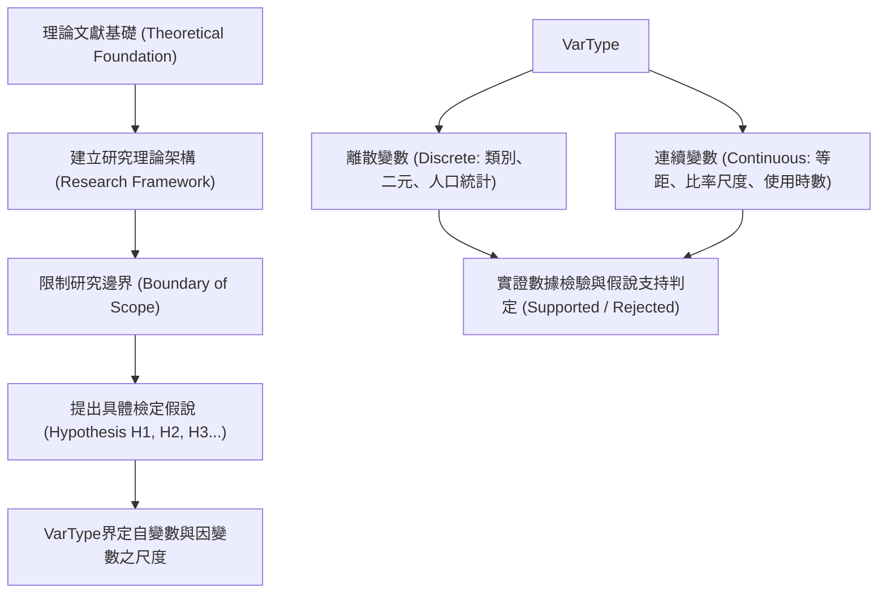

# 🛡️ RES-METH-02 資訊管理研究方法論 Lesson 02：概念界定、離散與連續變數、假說建立與理論架構檢證

> **課程主題**：學術概念思考邊界、變數尺度分類（離散 vs. 連續）、研究假說擬定與理論框架  
> **授課教授**：授課講師（資管所資深講座教授）  
> **核心模組**：Research Concepts, Discrete vs. Continuous Variables, Hypothesis Formulation  
> **學習目標**：掌握嚴謹概念界定、區分名目/順序/等距/等比尺度，建立可被實證檢驗之具體假說  
> **關聯文件**：[📄 完整原話逐字稿 (研究方法-02-假說建立與理論框架實證檢驗-proofread.md)](./研究方法-02-假說建立與理論框架實證檢驗-proofread.md)

---

## 🏛️ 核心架構與概念流轉圖

---

## 🔑 重點提要 (Key Takeaways)

1. **概念是思考與溝通的基石**：學術研究最忌「頭腦簡單」，所謂深刻思考即在於大腦中具備足夠豐富、邊界精準的專用概念，能向同行精確傳遞邏輯。
2. **變數尺度的統計意義**：離散變數（如性別、部門、是否採用某技術）與連續變數（如系統反應時間、月交易量）適用完全不同的統計檢定模型（卡方檢定 vs. 回歸分析/結構方程模型）。
3. **假說（Hypothesis）的邊界效應**：提出明確的假說能防止研究發散，為論文明確劃定「要包含什麼、不包含什麼」的嚴密範疇。
