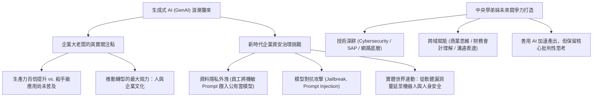

# 🛡️ KEYNOTE-GENAI-SEC 產學大師講座：生成式 AI 產業浪潮、企業資安治理與職場數位競爭力

> **演講主題**：生成式 AI 爆發浪潮、企業數位轉型困境、新型資安風險防禦與職涯發展  
> **主講貴賓**：勤業眾信聯合會計師事務所（Deloitte）資安執行副總（中央資管系所校友）  
> **主辦單位**：國立中央大學資訊管理學系碩士班 前瞻產業專題講座  
> **核心模組**：Generative AI, Enterprise Cybersecurity Governance, IT Career Pathways  
> **學習目標**：理解企業大老闆對 AI 的真實焦慮、掌握跨域顧問職能與 AI 時代不可替代核心競爭力  
> **關聯文件**：[📄 完整原話逐字稿 (勤業眾信副總-生成式AI浪潮與企業資安治理-proofread.md)](./勤業眾信副總-生成式AI浪潮與企業資安治理-proofread.md)

---

## 🏛️ 核心架構與概念流轉圖

---

## 🔑 重點提要 (Key Takeaways)

1. **AI 轉型的最大阻力永遠是「人」**：工具推陳出新極其快速，但企業內部既有流程、組織官僚文化與員工抗拒改變的心態，是 GenAI 無法在短期內轉化為殺手級應用的主要癥結。
2. **資安諮詢的高門檻與市場需求**：勤業眾信擁有全台最大的 200 人資安顧問團隊，負責政府核心機關與跨國企業的高規格資安審查與合規建置，資安業務是全事務所成長最迅猛、營收最高的業務板塊之一。
3. **不可替代的跨域 T 型人才**：純懂寫 Code 或純懂調包的工程師極易被 AI 替代。未來的頂尖顧問必須一手掌握網路與系統資安技術底層，另一手具備財務會計、法律合規與管理溝通的綜合治理視野。
