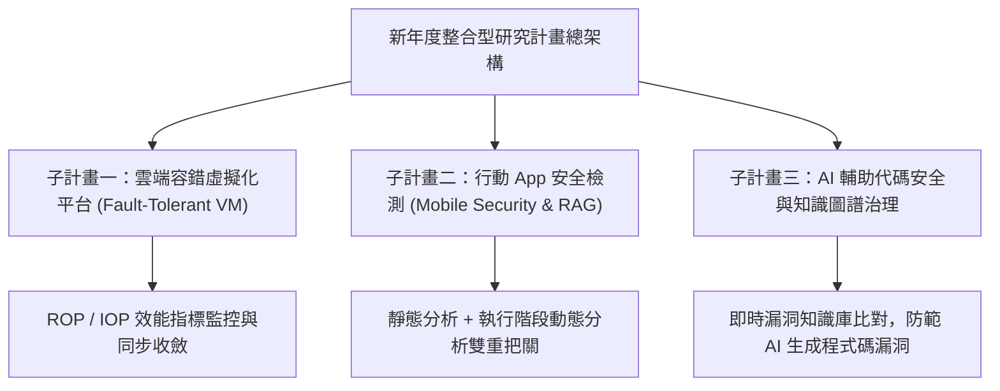

# 🛡️ LAB-MEETING-INTEGRATED-PROJECT 實驗室專案會議：新年度整合型產學研究計畫提案、容錯平台架構與資安模組整合

> **會議主題**：新年度整合型產學研究計畫架構討論、行動資安檢測、知識圖譜 RAG 與 VM 容錯效能指標  
> **主持人 / 指導教授**：指導教授、陳教授、全體碩博士研究團隊  
> **核心模組**：Integrated Research Project, Mobile Security, Fault-Tolerant Cloud, RAG & Knowledge Graph  
> **學習目標**：協同三大子計畫模組、統一跨系統資料格式與 VM 同步度量評估標準  
> **關聯文件**：[📄 完整原話逐字稿 (實驗室專案會議-新年度整合型研究計畫與平台架構規劃-proofread.md)](./實驗室專案會議-新年度整合型研究計畫與平台架構規劃-proofread.md)

---

## 🏛️ 核心架構與概念流轉圖

---

## 🔑 重點提要 (Key Takeaways)

1. **整合型計畫三大核心支柱**：容錯雲端底座、行動資安防護與 AI 程式碼安全稽核。確保各子計畫研發成果能無縫介接在統一的開放平台上。
2. **AI 工具輔助開發之風險防範**：針對開發人員日漸仰賴 AI 生成程式碼的趨勢，引入知識圖譜與動態 RAG 技術，在 Unit Test 階段即時阻斷未經修補之安全漏洞。
3. **VM 效能衡量統一化**：利用 IOP/ROP 度量指標量化虛擬機器的資源活躍度與同步延遲，確保容錯切換（Fault Tolerance）時業務不中斷。
