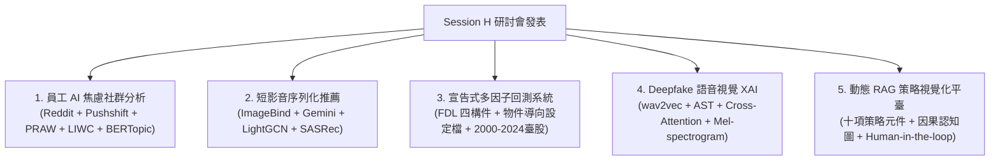
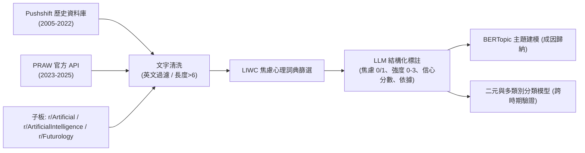
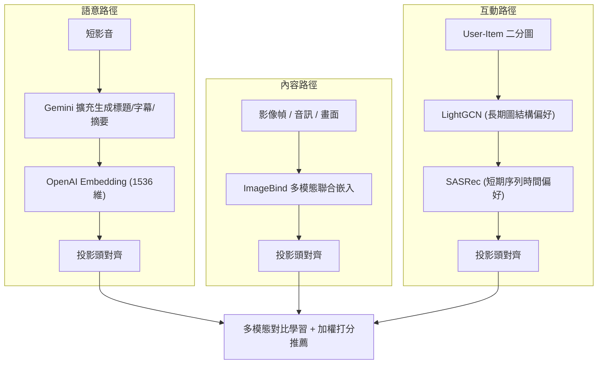
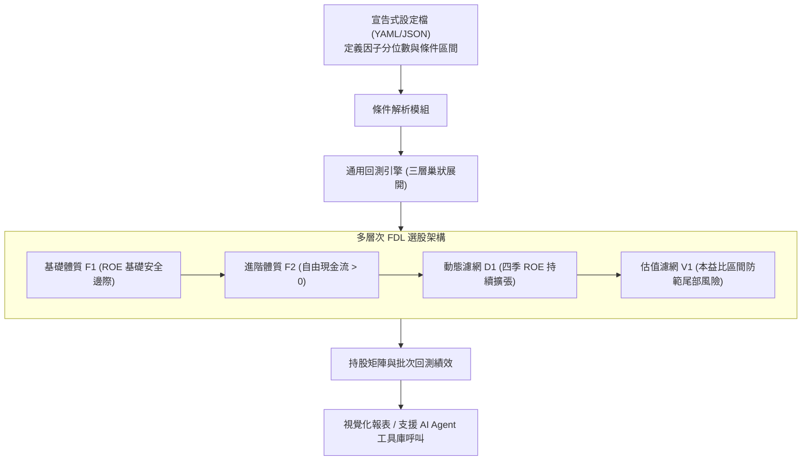
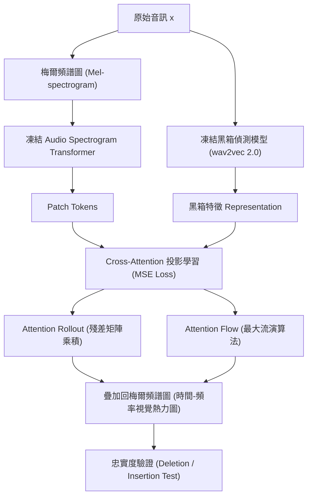

# 📈 研討會精華筆記：Session H 五篇論文研究綜述與技術全覽

> **研討會場次**：技術學術研討會 Session H (錄音 238)  
> **評審委員**：黃教授、李駿平教授（謝教授）  
> **涵蓋領域**：組織行為 NLP（AI 焦慮）、多模態推薦（短影音）、量化金融系統（宣告式多因子回測）、語音資安（Deepfake Audio XAI）、策略管理系統（動態 RAG 經營模式）  
> **發表陣容**：
> 1. 研究生 —— 員工 AI 焦慮與職場抵觸行為之社群文字分析
> 2. 高一婷（指導：陳任良/陳彥良教授）—— 基於語意增強與多模態對比學習之序列化短影片推薦
> 3. 研究生（指導：徐志成教授）—— 宣告式多因子量化回測系統設計與實作
> 4. 鍾國（指導教授群）—— 基於模型無關事後視覺解釋框架應用於深度偽造語音偵測
> 5. 張子龍（指導教授群）—— 經營模式創新：AI 輔助視覺化平臺整合動態 RAG 與人機協作之應用研究

---

## 📑 五大核心專題技術全覽

---

## 📱 專題一：員工 AI 焦慮與職場抵觸行為之社群文字分析

### 1. 研究動機與痛點
- **AI 焦慮浪潮**：ChatGPT 問世後，Google 搜尋趨勢中 `AI anxiety`、`AI dangerous`、`AI replace` 搜尋量急遽攀升。不安主要源於「工作取代恐懼」與「缺乏透明使用規範」，若未妥善處理將轉為職場消極抵觸。
- **方法限制突破**：傳統問卷量表存在社會期許偏誤且題項僵化；社群文字具備自然、即時與匿名優勢，適合捕捉真實情緒變化。

### 2. 資料收集與方法管線

### 3. 評審講評與 Q&A
- **評審（黃教授）回饋**：肯定文獻探討扎實；建議評估 LLM 是否能進一步直接用於情緒分類或噪聲歸因，並客觀比較機器學習與 LLM 之權衡；強調最終數據必須緊密扣合並回應三大 Research Questions。

---

## 📹 專題二：基於語意增強與多模態對比學習之序列化短影片推薦 (高一婷)

### 1. 痛點與挑戰
- **短影音特性**：更新極快、資訊高度異質（畫面、音訊、標題），文字標籤極度稀疏，傳統推薦存在嚴重冷啟動問題與單一模態偏差，且推薦延遲限制嚴格。

### 2. 三大路徑架構

### 3. 評審講評與 Q&A
- **評審建議**：肯定陳彥良教授實驗室方法學扎實；建議文獻標記發表年份；準備口試應對說法，論述為何採用「LightGCN + SASRec」之組合而非單一最新端到端模型的優勢（穩定性與協同/序列互補）。

---

## 📈 專題三：宣告式多因子量化回測系統設計與實作 (指導：徐志成教授)

### 1. 金融背景與痛點
- **因子動物園（Factor Zoo）**：學術界因子數量已突破 400 個，策略空間幾何級數暴增。傳統手寫腳本回測難以維持一致基準，容易引入前瞻偏誤（Look-ahead Bias）與過擬合。

### 2. FDL 架構與宣告式引擎

### 3. 評審講評與 Q&A
- **評審建議**：開場可舉生動實務投資困境；驗證時平衡 Efficiency（回測省時程度）與 Effectiveness（超額報酬與夏普比率）；文獻應引註實驗室學長先前開發的基礎平臺並強調本次宣告式重構之貢獻。

---

## 🎙️ 專題四：基於模型無關事後視覺解釋框架應用於深度偽造語音偵測 (鍾國)

### 1. 資安鑑識痛點
- **黑箱與不可解釋**：Deepfake 語音人耳辨識率僅 70%；wav2vec 2.0 / XLS-R 提取之高維嵌入向量已失去時間與頻率維度，無法在法庭或金融鑑識中說明「判定為偽造的實質依據」。

### 2. 視覺代理與注意力流架構

### 3. 評審講評與 Q&A
- **模型無關性確認**：鍾同學確認只要能取得倒數第二層特徵與原始音訊，任何模型皆能適用。
- **梅爾頻譜圖優勢**：梅爾刻度經短時距傅立葉轉換（STFT）與 Log 轉換，具備明確物理時間-頻率軸，且高度貼合人類耳蝸聽覺感知，是視覺鑑識的最佳媒介。

---

## 📊 專題五：經營模式創新：AI 輔助視覺化平臺整合動態 RAG 與人機協作 (張子龍)

### 1. 商業與技術整合
- **突破靜態 BMC**：傳統商業模式圖僅靜態填寫九宮格，缺乏元件連線與因果脈絡；傳統 RAG 靜態且 LLM 容易產生幻覺。
- **核心架構**：
  1. 涵蓋策略、市場與價值創造三大構面共十項策略元件；
  2. 動態 RAG（Dynamic RAG）：切片解析年報，將生成結果反饋回寫向量資料庫，形成最佳化閉環；
  3. 人機協作（Human-in-the-loop）：管理者直接在視覺化畫布上調整因果關係認知圖（Cognitive Map）。
- **評審建議**：受試者可進一步擴大至企業創辦人或各階管理者；架構圖展示應由 Big Picture 全域資料流切入。

---

## 🏆 大會閉幕與頒獎合影

- 感謝評審委員李駿平教授（謝教授）辛勞指導。
- 師生登臺歡樂合影（「一年見一次」、「三、二、一，笑一個」、「讚讚讚」、「耶」）。
- 司儀宣布優秀論文名單公布於系網頁與公告欄，下午 14:20 繼續進行下一場次。
