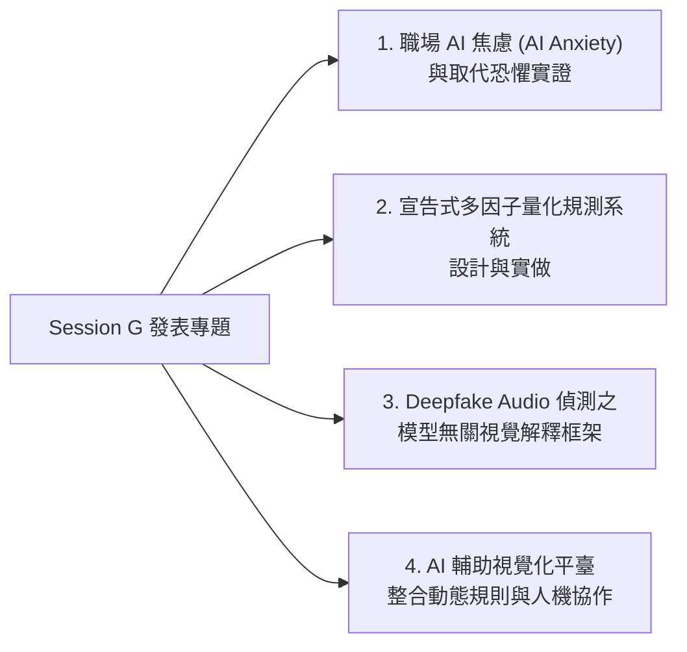

# 📈 研討會精華筆記：Session G 跨領域 AI 實證、量化系統與 Deepfake 語音解釋

> **研討會場次**：技術學術研討會 Session G（第 2 ~ 5 場論文發表合輯）  
> **涵蓋領域**：組織行為學（AI 焦慮）、金融科技（量化回測）、音訊資安（Deepfake 語音解釋）、企業商業模式（人機協作）  
> **核心亮點**：兼具「人文管理洞察」與「硬核技術工程」，從員工心理層面的 AI Anxiety，到深度偽造語音的可解釋性視覺化驗證。

---

## 📑 核心專題一覽

---

### 專題 1：員工 AI 焦慮 (AI Anxiety)、工作取代恐懼與組織因應
* **關鍵背景**：
  * 自 2022 年底生成式 AI 爆發以來，Google Trends 上 `AI anxiety`、`AI dangerous` 與 `AI replace` 搜尋量呈現階梯式暴增。
* **焦慮兩大根源**：
  1. **工作被取代的恐懼（Replacement Fear）**：員工擔憂自身技能被自動化演算法邊緣化。
  2. **溝通黑盒子（Opacity）**：企業內部缺乏透明的 AI 引進規範與技能轉型指引。
* **研究解方與建議**：
  * 企業若消極應對，焦慮將迅速演化為「職場消極牴觸（Workplace Resistance）」。
  * 領導層必須採取**透明化溝通**，主動提供「人機協同技能升級培訓」，將對立轉為協同增益。

---

### 專題 2：宣告式多因子量化規測系統設計與實做
* **解決痛點**：
  * 金融工程中，研究員撰寫多因子模型回測時，往往充斥著高度耦合的程式碼，因子計算、權重調整與滑價計算難以標準化。
* **技術架構**：
  * **宣告式語法（Declarative Paradigm）**：使用者只需在設定檔中宣告因子名稱（如動能、價值、波動度）與篩選條件，底層自動編譯為向量化計算管線。
  * **動態多因子檢驗**：自動產出因子 IC 值、IR 值、多空分層收益與最大回撤分析，大幅加速交易策略迭代。

---

### 專題 3：深度偽造聲音偵測 (Deepfake Audio) 之模型無關後驗視覺解釋框架
* **產業與司法痛點**：
  * 現今 Deepfake 語音偽造詐騙猖獗。現有偵測模型（如 AASIST、RawNet）雖然準確率高，但屬於**不可解釋的黑盒子**，無法作為法庭證據或資安鑑識採信。
* **創新架構**：
  * **模型無關（Model-Agnostic）**：無論底層使用何種音訊神經網路，皆能通用適配。
  * **後驗視覺解釋（Post-Hoc Visual Explanation）**：
    1. 將音訊轉換為時頻圖（Spectrogram）。
    2. 計算神經網路梯度顯著圖，標註出「最具偽造嫌疑」的特定音訊片段與頻率區間。
    3. **鑑識價值**：精準揭露聲音合成器留下的「高頻諧波斷裂」與「非自然相位偽影」，提供法證級視覺報告。

---

### 專題 4：AI 輔助視覺化平臺：動態規則與人機協作
* **發表人**：張子龍
* **研究核心**：
  * 結合動態商業邏輯規則引擎與 AI 視覺化畫布，讓非技術業務人員能夠與 AI Agent 協同設計工作流程。
  * 達成「人定邊界、AI 提效、動態監控」之敏捷商業運作體系。
