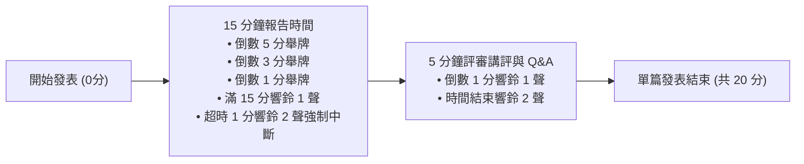
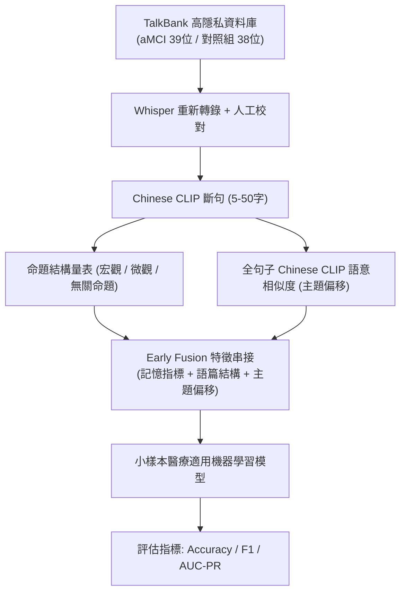
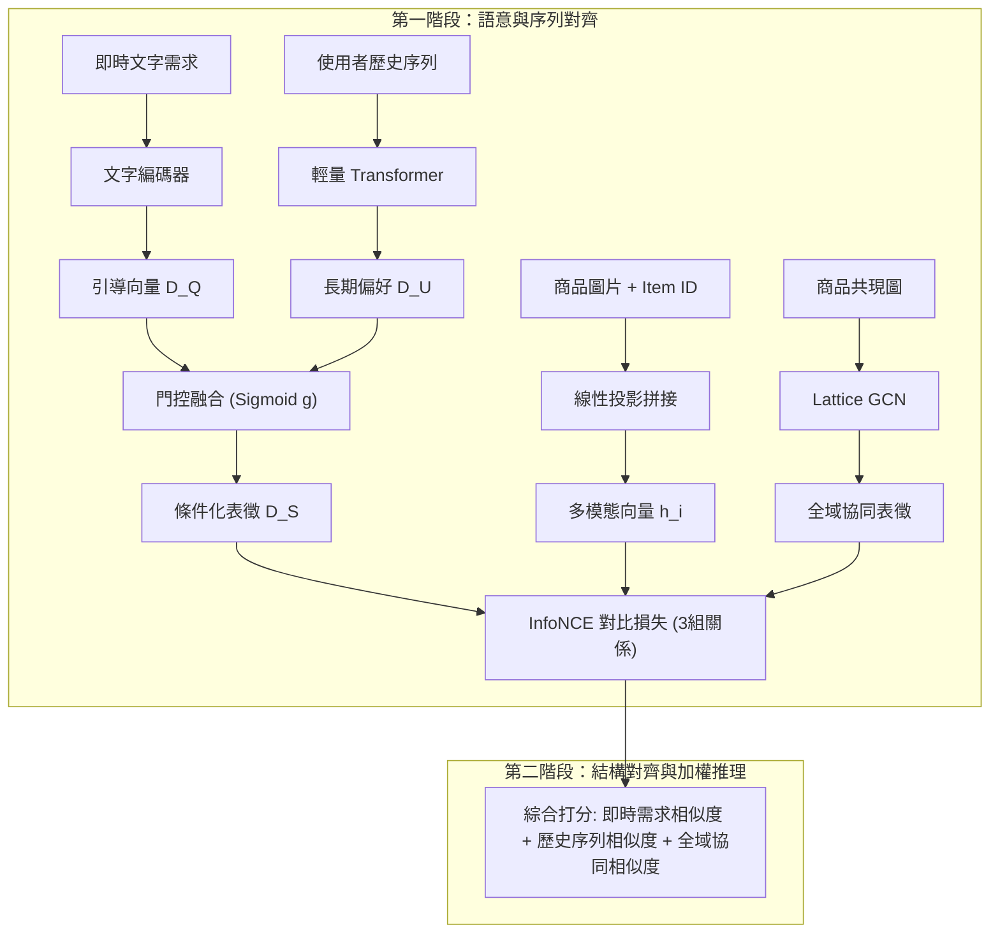
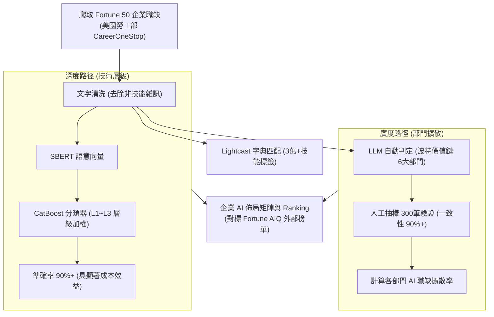

# 📊 研討會精華筆記：Session G 發表流程與四篇論文研究綜述

> **研討會場次**：技術學術研討會 Session G (教室門外海報公佈)  
> **評審委員**：資管系校友學長 (評審委員)  
> **大會議程**：每位發表者 20 分鐘（15 分鐘報告，5 分鐘委員講評）；倒數 5/3/1 分鐘舉牌，15 分鐘響鈴 1 聲，超時 1 分鐘響鈴 2 聲強制結束；講評倒數 1 分鐘響鈴 1 聲，結束響鈴 2 聲。  
> **發表陣容**：
> 1. 戴文芳（指導：曾小平教授、蘇國良博士）—— aMCI 語篇命題結構與主題偏移研究
> 2. 林之璇（指導：陳彥良教授）—— 整合視覺 ID 嵌入與圖對比對齊之條件感知序列推薦
> 3. 陳玉偉（指導：胡雅涵博士）—— 基於職缺文字的企業 AI 人力投入量化衡量框架
> 4. 彭博勝（指導：陳以真博士、邱淑瑜博士）—— NBGCL: 基於密度原型與加權對比學習之半監督影像分類研究

---

## ⏱️ Session G 議事流程與計時規範

---

## 🧠 論文一：整合語言學指標與語意嵌入之 aMCI 語篇命題結構與主題偏移研究 (戴文芳)

### 1. 研究背景與核心痛點
- **失智症與前期篩檢**：台灣已邁入超高齡社會，失智症盛行率達 8%，缺乏根治手段（藥物以 AChEI 為主）。前期「遺忘型輕度認知障礙 (aMCI)」為阿茲海默症高風險群，高階影像成本高，急需低成本客觀語言篩檢工具。
- **現有研究缺口**：多限於英文文獻，中文語篇研究極匱乏；過往多聚焦於微觀詞彙，缺乏「宏觀命題結構」與「動態主題偏移 (Topic Drift)」的聯合分析。

### 2. 方法論與架構

### 3. 評審講評與問答重點
- **臨床真實案例說明**：評審建議補充臨床上病患產生主題偏移的具體語言表現（如中途離題說「我不懂了、我爛了、講不出來」）。
- **大型語言模型 (LLM) 趨勢與資料隱私**：評審指出當前語意分析多結合 LLM，戴同學說明 TalkBank 嚴格禁止將受試者資料上傳或作為公開 LLM 訓練集，評審肯定隱私防護考量，並建議在未來展望中仍可討論本地端 LLM 融合之可能。
- **學術規範提醒**：論文與簡報應避免非正式寫法「ex」，應使用正規學術縮寫「e.g.」或文字「例如」。

---

## 🛒 論文二：整合視覺 ID 嵌入與圖對比對齊之條件感知序列推薦 (林之璇)

### 1. 研究背景與三大動機
- **推薦系統挑戰**：傳統協同過濾有冷啟動問題，內容過濾缺乏新穎性，且皆缺乏對使用者「當下即時需求」的感知（如搬家或出國導致需求驟變）。
- **三大缺口**：需求語境缺失、多模態整合不足（純視覺難分外觀相近商品）、全域協同訊號缺乏即時引導。

### 2. 兩階段模型架構

### 3. 實驗與評審講評
- **實驗成果**：在 Amazon Home & Kitchen 與 Sports & Outdoor 資料集上，以 ChatGPT-4o 生成 pseudo query 模擬真實情境，在 HR、NDCG、MRR 等指標全面顯著超越 9 個 baseline。
- **評審建議**：文獻回顧應補齊 2024-2026 最新文獻；建議探討動態時序 GNN (Temporal GNN) 在即時圖結構上的應用；加強凸顯 ID embedding 結合視覺特徵之創新優勢。

---

## 📊 論文三：基於職缺文字的企業 AI 人力投入量化衡量框架 (陳玉偉)

### 1. 研究背景與理論基礎
- **人力資本量化**：傳統財報指標（研發支出、員工人數）為落後指標且無法反映技術動態。線上職缺（Online Job Postings）具備即時性與細緻度，直接反映企業技術佈局與吸收能力。
- **理論整合**：訊號理論（職缺為企業主動釋放的技能訊號）＋ 吸收能力理論（外部知識內化與跨部門橫向擴散）。

### 2. 深度與廣度雙軌架構

### 3. 評審講評與 Q&A
- **方法選用邏輯**：評審詢問為何深度用機器學習、廣度用 LLM。陳同學答覆：深度著重技術層級分類，機器學習準確率已達 90% 且運算成本遠低於 LLM；廣度部門分類文字篇幅長且高度依賴全局商業脈絡，需要 LLM 的強大理解能力。
- **評審建議**：肯定架構之客觀可重現性，建議未來可輔以少數專家訪談案例佐證企業實務落地意義。

---

## 🖼️ 論文四：NBGCL 基於密度原型與加權對比學習之半監督影像分類研究 (彭博勝)

### 1. 背景與核心問題
- **半監督學習痛點**：電腦視覺領域高品質標註資料成本極高（如 PCB 電路板缺陷檢測），而未標籤資料充沛。傳統半監督自訓練容易因早期偽標籤錯誤而累積確認偏差（Confirmation Bias），導致模型崩潰。

### 2. NBGCL 核心技術特色
1. **密度原型 (Density Prototypes)**：以樣本間最小距離動態建置高密度核心，有效捕捉異質分佈。
2. **先驗分佈 KL 對齊**：結合分類器機率與密度原型先驗分佈，利用 KL 散度進行低風險對齊。
3. **雙門檻篩選 (Dual-threshold)**：同時要求分類機率閥值與特徵向量空間相似度門檻，並使用軟式交叉熵（Soft Cross-Entropy）避免資訊損失。
4. **加權對比學習**：依據預測機率相似度對梯度施加動態權重，解決不確定樣本的拉伸衝突。

### 3. 實驗成果與評審建議
- **實驗表現**：在 CIFAR-10（極少標籤 40/250 labels）、CIFAR-100、SVHN 上顯著領先 FixMatch 等基準。
- **評審建議**：消融實驗建議以完整橫向表格對比 baseline，清晰展現各模組之貢獻；目前 CIFAR-10 準確率已達 95%，建議在更具挑戰性的類別（如 CIFAR-100 或工業瑕疵資料）測試以突顯模組之 Delta 改善幅度。

---

## 🏆 大會閉幕與頒獎合影

- 評審委員肯定全體發表學生研究扎實、簡報精緻。
- 現場發表學生代表與評審合影留念（「中央大學 NCU 耶！」、「反手耶」）。
- 司儀宣布優秀論文名單將公告於系網頁與公告欄，學生代表至系辦領取獎狀獎金，Session G 圓滿閉幕。
