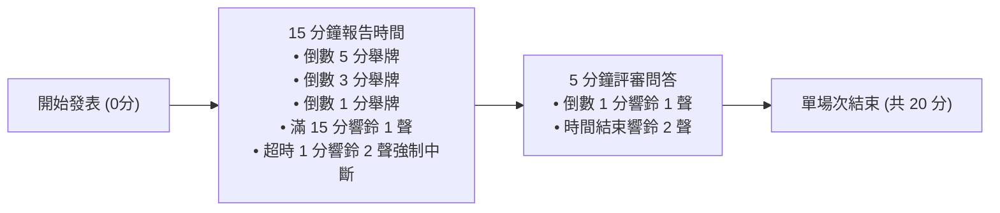
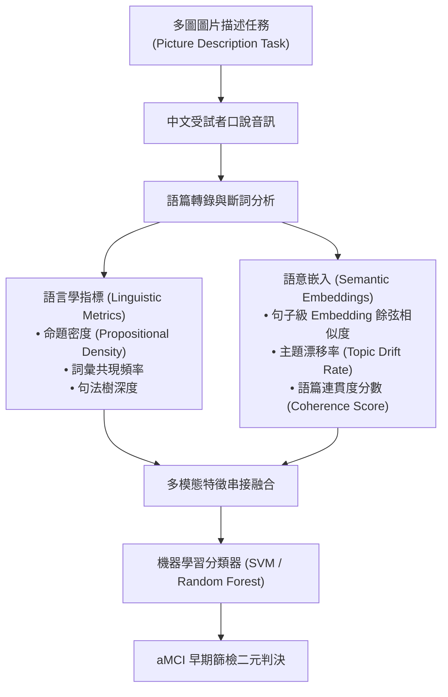

# 📊 研討會精華筆記：Session G 發表流程與 aMCI 語篇結構研究 (戴文芳)

> **研討會場次**：技術學術研討會 Session G  
> **主持與評審**：研討會評審委員會  
> **核心主題**：大會議事規則說明、失智前期 aMCI 語言退化與主題偏移偵測  
> **主要發表人**：戴文芳（指導教授：曾小平教授、蘇國良博士）  
> **研究成果**：建構中文語篇命題結構與語意嵌入融合架構，突破傳統僅依賴微觀詞彙的瓶頸，大幅提升早期遺忘型輕度認知障礙（aMCI）的快篩分類辨識率。

---

## ⏱️ Session G 議事流程與計時規範

---

## 🧠 論文一：整合語言學指標與語意嵌入之 aMCI 語篇命題結構與主題偏移研究

### 1. 研究背景與高齡化挑戰
* **失智症危機**：臺灣老年人口已突破 20% 門檻，衛福部統計失智症盛行率高達 8%，高居全球第七大死因，缺乏根治療法。
* **關鍵黃金窗口（aMCI）**：失智症前期為「遺忘型輕度認知障礙 (amnestic Mild Cognitive Impairment, aMCI)」，此階段大腦已出現輕微語言退化，是早期介入治療的唯一黃金期。
* **現有研究瓶頸**：
  1. 過去文獻 90% 以上聚焦於英文語系，中文專屬研究極度匱乏。
  2. 現有方法多限於「微觀特徵」（詞彙豐富度、單句長度、語法錯誤），忽略了「宏觀語篇結構（Discourse Structure）」與「主題偏移（Topic Drift）」。

---

### 2. 核心方法論與實驗架構

1. **多重圖片描述任務設計**：
   - 採用多組不同場景但語意複雜度一致的圖片，避免受試者單一記憶疲勞或偶發性語言偏差。
2. **語篇命題結構 (Propositional Structure)**：
   - 提取受試者發言中的核心論元（Predicate-Argument Structure），量化在單位時間內所能傳達的有效實質資訊量。
3. **動態主題偏移量測 (Topic Drift Measurement)**：
   - 計算連續語句之間在嵌入空間中的向量距離。aMCI 患者往往在講述過程逐漸偏離圖片核心情境，產生離題現象。

---

### 3. 評審委員問答精華與討論重點
* **委員提問一（圖片刺激物的難易度控制）**：
  - *問題*：不同圖片在視覺元素數量與動作複雜度上是否存在偏差？是否會導致同一患者在不同圖片的語篇分數差異過大？
  - *答辯*：研究團隊在前期進行了正規化難易度校準，確保每張圖片的核心核心命題數控制在 8~10 個標準區間。
* **委員提問二（模型泛化性與教育程度干擾）**：
  - *問題*：受試者的教育程度（小學 vs 大學）是否會強烈干擾語言學指標？
  - *答辯*：微觀語法可能受教育程度影響，但本研究採用的「語篇連貫度」與「主題偏移率」屬於認知控制機制，在控制年齡與教育變因後，依然具備顯著的組間差異。
