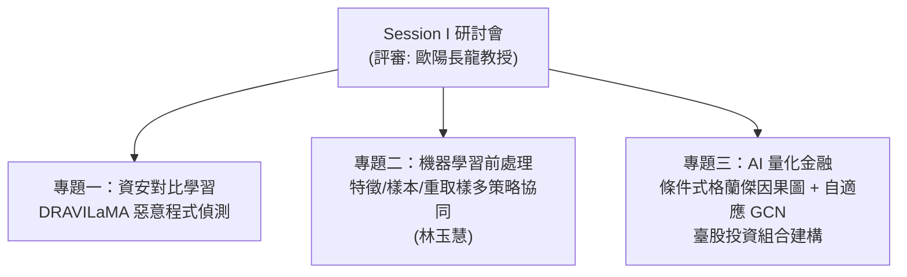
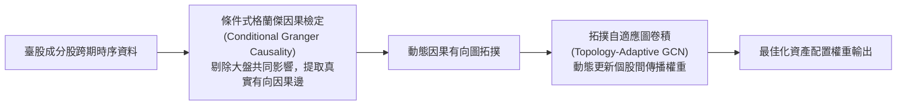

# 📊 研討會精華筆記：Session I 評審專題（歐陽長龍教授場次）

> **研討會場次**：技術學術研討會 Session I（教室 I202）  
> **特邀評審委員**：歐陽長龍教授（南洋大學）  
> **發表專題**：
> 1. 《DRAVILaMA：對比學習微調 LLM 結合圖結構之 Android 惡意程式抗混淆偵測》（沈柏寧/沈柏寧）  
> 2. 《多策略資料前處理研究：特徵選取、樣本選取與重取樣之協同機制》（林玉慧，資管碩二）  
> 3. 《Sequential TAG：條件式格蘭傑因果圖與拓撲自適應 GCN 於臺股投資組合之建構》（量化金融專題）  
> **評審特色**：歐陽長龍教授從「實務落地價值」、「統計假設嚴謹度」與「時序因果洩漏（Lookahead Bias）」進行全方位高強度講評。

---

## 🏛️ Session I 專題架構圖解

---

### 專題 1：DRAVILaMA 研討會發表精華
* **發表人**：沈柏寧 / 沈柏寧
* **核心匯報**：
  * 針對 Android 動態反射混淆（Reflection），提出 **「CodeLlama 對比學習語意嵌入 + 3層 GIN 圖結構」** 之多模態架構。
  * 展現面對未知混淆工具 AML 時的高韌性偵測能力，向評審展示混淆前後 Embedding 歐氏距離縮小 46.3% 的 t-SNE 視覺化證據。

---

### 專題 2：多策略資料前處理研究：特徵選取、樣本選取與重取樣
* **發表人**：林玉慧（資管研究所碩二）
* **解決核心難題**：
  * 現實世界資料集普遍存在「**高維度冗餘（Curse of Dimensionality）**」與「**極度類別不平衡（Extreme Class Imbalance）**」。
  * 單一使用 SMOTE（過取樣）容易合成邊緣雜訊；單一特徵選取容易遺失微弱但關鍵的非線性特徵。
* **三重協同策略架構**：
  1. **特徵選取（Feature Selection）**：以互資訊（Mutual Information）與特徵重要度剔除無關維度。
  2. **樣本篩選（Sample Selection / Cleaning）**：利用 Tomek Links 偵測並剔除重疊邊界附近的模糊噪聲樣本。
  3. **動態重取樣（Adaptive Resampling）**：對乾淨的安全邊界樣本實施局部合成增強。
* **評審講評與建議**：
  * 歐陽長龍教授提醒：三步前處理的先後順序（Pipeline Order）至關重要，必須嚴格在 K-fold 交叉驗證的 Training Fold 內執行，切勿污染 Validation Fold，以防資料洩漏（Data Leakage）。

---

### 專題 3：Sequential TAG：條件式格蘭傑因果圖與自適應 GCN 於臺股投資組合
* **金融理論瓶頸**：
  * 傳統馬可維茲（Markowitz）均異模型與相關係數矩陣，僅能捕捉資產間的「靜態線性關係」，無法捕捉市場傳導的「**跨期領先-落後因果性（Lead-Lag Causality）**」。
* **創新架構解析**：

1. **條件式格蘭傑因果（Conditional Granger Causality）**：
   - 排除加權指數（大盤因子）對所有股票的共同干擾，提煉出產業鏈上下游個股之間的**真實超額因果影響圖**。
2. **拓撲自適應圖卷積 (TAGCN)**：
   - 傳統 GCN 依賴固定的鄰接矩陣（Adjacency Matrix），TAGCN 能隨市場多空週期動態自適應更新個股關聯拓撲。
3. **實證績效表現**：
   - 在臺股成分股歷史回測中，Sequential TAG 策略的**夏普值（Sharpe Ratio）**與**最大回撤（Max Drawdown）**指標，全數顯著優於傳統市值加權指數、等權重基準以及靜態 GCN 模型。
* **歐陽長龍教授專業點評**：
  * 指出格蘭傑檢定之時序落後期數（Lag Order）需注意市場高頻雜訊，建議未來可加入當日即時成交量委買委賣動能作為即時門檻過濾。
